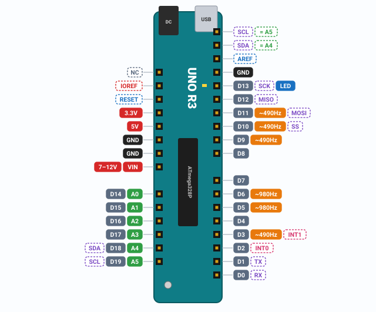
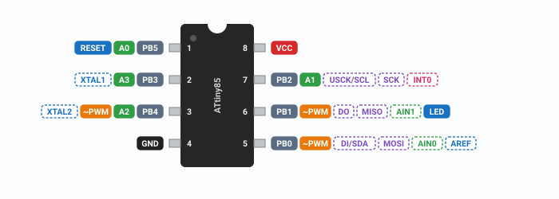
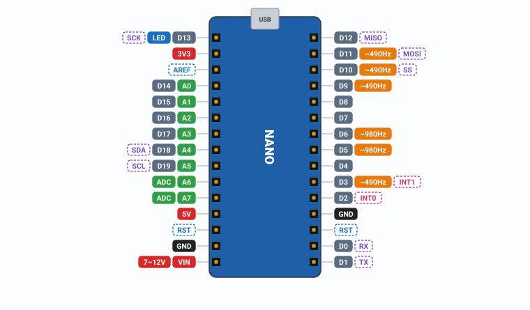
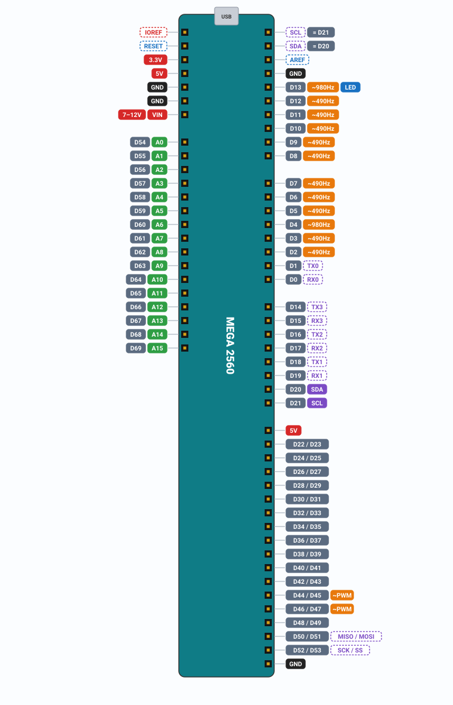
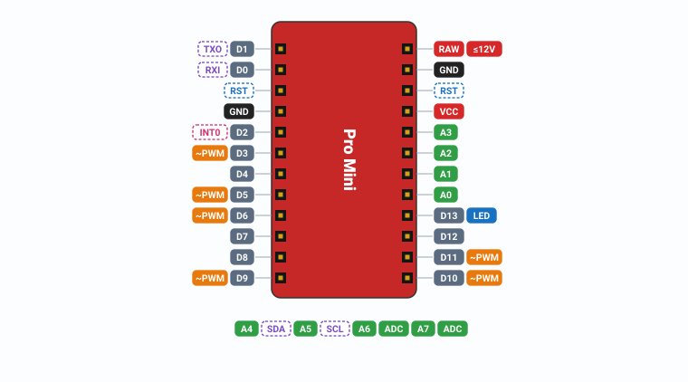
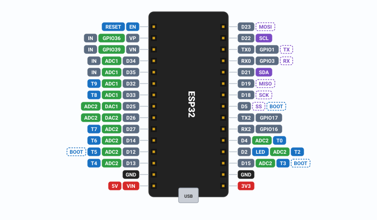
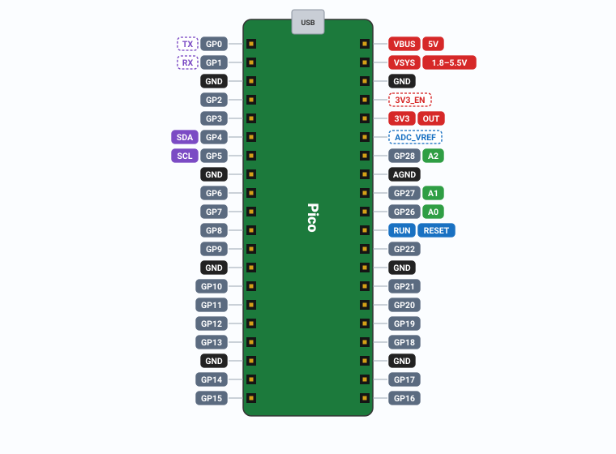
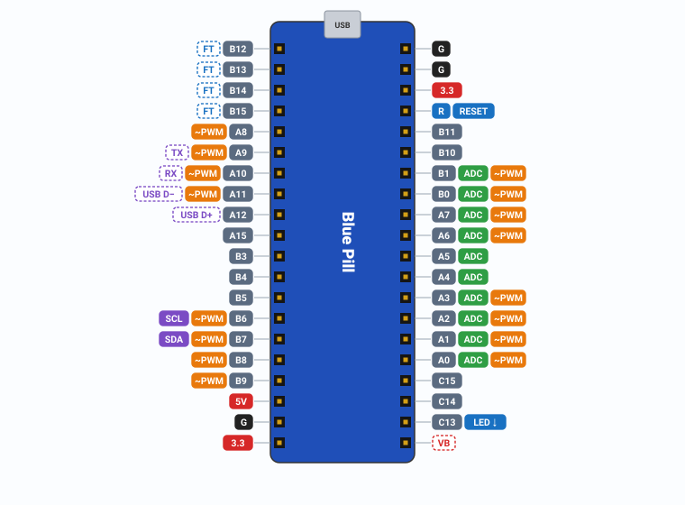
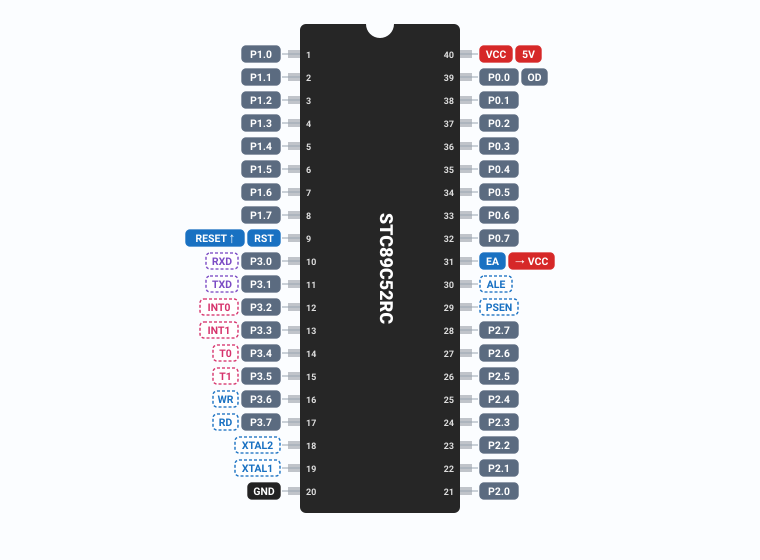

# Microcontroller pinout, common usage and examples

> Generated by `tools/gen-pinout-docs.js` from the same data as the in-app “Pinout” panel, so both always match.  
> In the app: select the board or chip → “📌 Pinout” in the properties panel or in the program editor toolbar; the examples are also in the “Examples” menu at the top.  
> [中文版](pinout-zh.md)

## Contents

- [Arduino Uno board](#arduino)
- [ATtiny85 microcontroller (8-pin)](#attiny85)
- [Arduino Nano Board](#nano)
- [Arduino Mega 2560 Board](#mega)
- [Arduino Pro Mini Board](#promini)
- [ESP32 DevKit V1 (30-pin)](#esp32)
- [Raspberry Pi Pico](#pico)
- [STM32 Blue Pill (F103C8)](#bluepill)
- [8051 MCU (STC89C52 / AT89C52, DIP-40)](#c51)
- [Common usage](#usage)
- [Sensors](#sensors)
- [Examples](#examples)

<a id="arduino"></a>

## Arduino Uno board

Arduino Uno R3 (ATmega328P, 16 MHz, 5 V logic): 14 digital pins D0–D13 (6 of them marked ~ can output PWM) and 6 analog inputs A0–A5 (10-bit ADC, also usable as digital pins D14–D19). Below: the pin map, what every pin does, electrical limits, what the simulator supports, common usage, and finally examples you can load with one click.

### Pin map



`Digital I/O` · `PWM output` · `Analog input` · `Communication (UART/SPI/I²C)` · `External interrupt` · `Power` · `Ground` · `Special function` — Dashed = not simulated

### Pin table

| Pin | Port / datasheet names | Functions & notes | Simulated |
|---|---|---|---|
| **D0** | PD0 · RXD | digital in/out, ~~serial receive RX~~<br>D0/D1 are wired to the board's USB-serial chip: uploading and `Serial` both use them, and external circuits on them can make uploads fail. In the simulator D0/D1 work as plain I/O and `Serial` goes straight to the serial monitor. | ◐ partly |
| **D1** | PD1 · TXD | digital in/out, ~~serial transmit TX~~ | ◐ partly |
| **D2** | PD2 · INT0 | digital in/out, ~~external interrupt INT0~~ | ◐ partly |
| **D3 ~** | PD3 · OC2B · INT1 | digital in/out, PWM ≈ 490 Hz, ~~external interrupt INT1~~<br>`tone()` uses Timer2, so PWM on D3 and D11 stops working while a tone plays. | ◐ partly |
| **D4** | PD4 | digital in/out | ✓ yes |
| **D5 ~** | PD5 · OC0B | digital in/out, PWM ≈ 980 Hz | ✓ yes |
| **D6 ~** | PD6 · OC0A | digital in/out, PWM ≈ 980 Hz | ✓ yes |
| **D7** | PD7 | digital in/out | ✓ yes |
| **D8** | PB0 | digital in/out | ✓ yes |
| **D9 ~** | PB1 · OC1A | digital in/out, PWM ≈ 490 Hz<br>The Servo library uses Timer1, so `analogWrite()` no longer works on D9 and D10 (whichever pin the servo is on). | ✓ yes |
| **D10 ~** | PB2 · OC1B · SS | digital in/out, PWM ≈ 490 Hz, ~~SPI slave select SS~~ | ◐ partly |
| **D11 ~** | PB3 · OC2A · MOSI | digital in/out, PWM ≈ 490 Hz, ~~SPI MOSI (master out)~~<br>`tone()` uses Timer2, so PWM on D3 and D11 stops working while a tone plays. | ◐ partly |
| **D12** | PB4 · MISO | digital in/out, ~~SPI MISO (master in)~~ | ◐ partly |
| **D13** | PB5 · SCK | digital in/out, ~~SPI clock SCK~~, on-board LED “L”<br>The on-board LED “L” is driven by D13 (`LED_BUILTIN`), buffered by an op-amp on the R3. D13 is also SPI SCK, so the LED flickers while SPI is in use. | ◐ partly |
| **A0 (D14)** | PC0 · ADC0 | analog input (10-bit ADC), digital in/out | ✓ yes |
| **A1 (D15)** | PC1 · ADC1 | analog input (10-bit ADC), digital in/out | ✓ yes |
| **A2 (D16)** | PC2 · ADC2 | analog input (10-bit ADC), digital in/out | ✓ yes |
| **A3 (D17)** | PC3 · ADC3 | analog input (10-bit ADC), digital in/out | ✓ yes |
| **A4 (D18)** | PC4 · ADC4 · SDA | analog input (10-bit ADC), digital in/out, ~~I²C data SDA~~<br>A4/A5 are also the I²C SDA/SCL pins (the R3 repeats them as an SDA/SCL header next to AREF). While I²C is in use they cannot be analog inputs. | ◐ partly |
| **A5 (D19)** | PC5 · ADC5 · SCL | analog input (10-bit ADC), digital in/out, ~~I²C clock SCL~~ | ◐ partly |
| **5V** |  | 5 V supply<br>Comes from the on-board 5 V regulator (when powered through VIN/DC) or from USB. Fine for sensors and small modules; on USB the whole board is limited by a 500 mA resettable fuse. You can also feed a regulated 5 V in here, but that bypasses the regulator and protection. | ✓ yes |
| **3.3V** |  | 3.3 V supply output<br>On-board 3.3 V regulator output, 50 mA max. | ✓ yes |
| **VIN** |  | external supply input VIN<br>External supply input (the DC jack reaches it through a diode): 7–12 V recommended, 6–20 V limits. Below 7 V the 5 V rail may sag; above 12 V the regulator runs hot. | ✓ yes |
| **GND ×3** |  | ground GND<br>All GND pins are connected. The negative side of any external supply (battery, motor supply) must be joined to the Arduino GND (common ground) so signals share a reference. | ✓ yes |
| **RESET** | PC6 | ~~reset (active low)~~<br>Pull low to reset; the reset button is wired here. The simulated part has no such pin — use the “Reset” button in the program editor instead. | — pin not on the part |
| **AREF** | AREF | ~~analog reference AREF~~<br>External analog reference input (0–5 V) for `analogReference(EXTERNAL)`; select EXTERNAL before connecting a voltage or the chip may be damaged. The simulated part has no such pin and treats EXTERNAL as VCC (5 V). | — pin not on the part |
| **IOREF** |  | ~~I/O voltage reference IOREF~~<br>Tells shields the board's I/O voltage (5 V on the Uno). Not on the simulated part. | — pin not on the part |
| **SDA / SCL** | = A4 / A5 | ~~I²C data SDA~~, ~~I²C clock SCL~~<br>Extra I²C header added on the R3, electrically the same as A4/A5. I²C (the Wire library) is not simulated. | — pin not on the part |
| **ICSP** | MISO · SCK · MOSI · RESET · 5V · GND | ~~ICSP programming header~~<br>6-pin in-circuit serial programming header, used to burn the bootloader or upload with a programmer. Not needed in the simulator. | — pin not on the part |

~~external interrupt INT0~~ = no

### Electrical limits

- Each I/O pin: 20 mA recommended, 40 mA absolute maximum — more can permanently damage the port.
- Total current of all pins together (through VCC/GND) at most 200 mA.
- Pin voltage must stay within −0.5 V … VCC + 0.5 V; input LOW < 0.3·VCC (1.5 V), HIGH > 0.6·VCC (3 V).
- Internal pull-up resistors 20–50 kΩ (`INPUT_PULLUP`).
- Analog inputs 0–5 V (default reference = VCC), 10 bits → 0–1023, about 4.9 mV per step; source impedance should be ≤ 10 kΩ.
- VIN / DC jack: 7–12 V recommended, 6–20 V limits; USB supplies 5 V through a 500 mA resettable fuse.
- 3.3V pin: 50 mA max; how much the 5V pin can deliver depends on the supply (whole board ≤ 500 mA on USB, limited by regulator heating on VIN).
- ATmega328P: 16 MHz, 32 KB Flash (0.5 KB used by the bootloader), 2 KB SRAM, 1 KB EEPROM.

<a id="attiny85"></a>

## ATtiny85 microcontroller (8-pin)

ATtiny85 (8-pin DIP, 8-bit AVR): 5 general-purpose I/O pins PB0–PB4 plus PB5 (RESET by default). No hardware UART; PWM on PB0/PB1/PB4, ADC on PB2/PB3/PB4 (and PB5). 8 KB Flash, 512 B SRAM, 512 B EEPROM; shipped running from the internal 8 MHz RC oscillator divided by 8 = 1 MHz (CKDIV8 fuse).

### Pin map



`Digital I/O` · `PWM output` · `Analog input` · `Communication (UART/SPI/I²C)` · `External interrupt` · `Power` · `Ground` · `Special function` — Dashed = not simulated

### Pin table

| Pin | Port / datasheet names | Functions & notes | Simulated |
|---|---|---|---|
| **1 · PB5** | PCINT5 · RESET · ADC0 · dW | RESET (active low), analog input (10-bit ADC), digital in/out<br>RESET by default (active low, internal pull-up), so it is not a normal I/O pin; in the simulator pulling it below 0.3·VCC holds the chip in reset. Only programming the RSTDISBL fuse turns it into a (weak) I/O pin, and after that ISP programming no longer works until a high-voltage programmer restores it. In the simulator you can tick “PB5 as normal I/O” in the properties. | ✓ yes |
| **2 · PB3** | PCINT3 · XTAL1 · CLKI · OC1B̅ · ADC3 | digital in/out, analog input (10-bit ADC), ~~external crystal pin~~<br>PB3/PB4 are also the external crystal pins and cannot be used as I/O with an external crystal. The default clock is the internal RC oscillator, so they are free. | ◐ partly |
| **3 · PB4** | PCINT4 · XTAL2 · CLKO · OC1B · ADC2 | digital in/out, PWM output (analogWrite), analog input (10-bit ADC), ~~external crystal pin~~ | ◐ partly |
| **4 · GND** |  | ground GND | ✓ yes |
| **5 · PB0** | MOSI · DI · SDA · AIN0 · OC0A · OC1A̅ · AREF · PCINT0 | digital in/out, PWM output (analogWrite), ~~USI data in DI / I²C SDA~~, ~~SPI MOSI (master out)~~, ~~analog comparator input~~, ~~external reference AREF~~<br>Physical pin 5: PWM (OC0A), USI DI / I²C SDA, MOSI for ISP programming, and the optional external AREF (then it is no longer an I/O pin). | ◐ partly |
| **6 · PB1** | MISO · DO · AIN1 · OC0B · OC1A · PCINT1 | digital in/out, PWM output (analogWrite), ~~USI data out DO~~, ~~SPI MISO (master in)~~, ~~analog comparator input~~, on-board LED on Digispark-type boards<br>Physical pin 6: PWM (OC0B / OC1A), USI DO, MISO for ISP programming. Boards such as the Digispark put their on-board LED here. | ◐ partly |
| **7 · PB2** | SCK · USCK · SCL · ADC1 · T0 · INT0 · PCINT2 | digital in/out, analog input (10-bit ADC), ~~USI clock USCK / I²C SCL~~, ~~SPI clock SCK~~, ~~external interrupt INT0~~<br>Physical pin 7: the only external interrupt INT0, analog input A1 (ADC1), USI clock USCK / I²C SCL, SCK for ISP programming. | ◐ partly |
| **8 · VCC** |  | supply VCC<br>Supply 2.7–5.5 V (ATtiny85V: 1.8–5.5 V); faster clocks need more voltage (20 MHz needs 4.5 V or more). Put a 100 nF decoupling capacitor between VCC and GND close to the chip. | ✓ yes |

~~external crystal pin~~ = no

### Electrical limits

- Each I/O pin: ≤ 20 mA recommended, 40 mA absolute maximum; total through VCC/GND ≤ 200 mA.
- Supply 2.7–5.5 V (ATtiny85V: 1.8–5.5 V); up to 10 MHz from 2.7 V, 20 MHz needs 4.5–5.5 V.
- Pin voltage −0.5 V … VCC + 0.5 V; internal pull-ups 20–50 kΩ.
- ADC: 10 bits, 4 single-ended inputs ADC0–ADC3 = PB5 / PB2 / PB4 / PB3; reference VCC, internal 1.1 V, internal 2.56 V or external AREF on PB0.
- Memory: 8 KB Flash, 512 B SRAM, 512 B EEPROM.
- Clock: shipped as internal 8 MHz RC ÷ 8 = 1 MHz (CKDIV8 fuse); can be changed to internal 8 MHz, 16 MHz PLL, or an external crystal (uses PB3/PB4).

<a id="nano"></a>

## Arduino Nano Board

Arduino Nano (ATmega328P, 16 MHz, 5 V logic): the same chip as the Uno on a small breadboard-friendly board. D0–D13 (6 PWM pins marked ~), A0–A7 (10-bit ADC; A6/A7 are analog-only), Mini-USB socket, 7–12 V on VIN.

### Pin map



`Digital I/O` · `PWM output` · `Analog input` · `Communication (UART/SPI/I²C)` · `External interrupt` · `Power` · `Ground` · `Special function` — Dashed = not simulated

### Pin table

| Pin | Port / datasheet names | Functions & notes | Simulated |
|---|---|---|---|
| **D0 / D1** | PD0 · RXD / PD1 · TXD | digital in/out, ~~serial receive RX~~, ~~serial transmit TX~~<br>D0/D1 are wired to the board's USB-serial chip: uploading and `Serial` both use them, and external circuits on them can make uploads fail. In the simulator D0/D1 work as plain I/O and `Serial` goes straight to the serial monitor. | ◐ partly |
| **D2, D4, D7, D8, D12** | PD2 · PD4 · PD7 · PB0 · PB4 | digital in/out | ✓ yes |
| **D3, D9, D10, D11 ~** | OC2B · OC1A · OC1B · OC2A | digital in/out, PWM ≈ 490 Hz<br>`tone()` uses Timer2, so PWM on D3 and D11 stops working while a tone plays. | ✓ yes |
| **D5, D6 ~** | OC0B · OC0A | digital in/out, PWM ≈ 980 Hz | ✓ yes |
| **D13** | PB5 · SCK | digital in/out, ~~SPI clock SCK~~, on-board LED “L”<br>The on-board LED “L” is connected to D13 through a resistor: it lights whenever D13 is HIGH and adds a load when D13 is used as an input. | ◐ partly |
| **A0–A5 (D14–D19)** | PC0–PC5 · ADC0–ADC5 | analog input (10-bit ADC), digital in/out<br>A4/A5 are also the I²C pins SDA/SCL (Wire). A0–A5 can be used as digital pins D14–D19. | ✓ yes |
| **A6, A7** | ADC6 · ADC7 | analog input (10-bit ADC)<br>A6 and A7 (ADC6/ADC7 exist only on the small TQFP/QFN package) are connected only to the ADC: `analogRead(A6)` works, but `pinMode`, `digitalRead` and `digitalWrite` do not — the simulator reports an error. | ✓ yes |
| **5V** |  | 5 V supply<br>5 V rail: comes from USB (through a Schottky diode) or from the on-board regulator fed by VIN. You may also feed a regulated 5 V here, which bypasses the regulator. | ✓ yes |
| **3V3** |  | 3.3 V supply output<br>3.3 V output; on the original Nano it comes from the USB-serial chip (FT232RL), so only a small current (about 50 mA) is available. | ✓ yes |
| **VIN** |  | external supply input VIN<br>External supply input (the DC jack reaches it through a diode): 7–12 V recommended, 6–20 V limits. Below 7 V the 5 V rail may sag; above 12 V the regulator runs hot. | ✓ yes |
| **GND ×2** |  | ground GND<br>All GND pins are connected together on the board; any of them can be used. | ✓ yes |
| **RST ×2 · AREF** | PC6 · AREF | ~~reset (active low)~~, ~~analog reference AREF~~<br>RESET, AREF (and IOREF on the Mega) exist on the real board but are not terminals of the simulated part. | — pin not on the part |

~~serial receive RX~~ = no

### Electrical limits

- Each I/O pin: ≤ 20 mA recommended, 40 mA absolute maximum; total through VCC/GND ≤ 200 mA.
- VIN 7–12 V recommended (6–20 V limits). USB is protected by a 500 mA resettable fuse on the original board.
- Pin voltage −0.5 V … VCC + 0.5 V; internal pull-ups 20–50 kΩ; ADC 10 bits, reference VCC (default) or internal 1.1 V.
- Memory: 32 KB Flash (bootloader uses 0.5–2 KB), 2 KB SRAM, 1 KB EEPROM.

### Simulator support

- ✗ External interrupts `attachInterrupt()`: reported as unsupported when compiling — poll the pin or use `millis()` instead.
- ✗ Over-current does not “burn” the chip: the simulator only warns, so check your design against the electrical limits.
- ✗ EEPROM, sleep modes, the watchdog, fuse settings and direct register access (such as `PORTB`, `DDRB`) are not supported.
- ✗ Instruction timing is not modelled: code runs instantly and only `delay()`, `millis()` and friends advance time; an endless loop that exceeds the work limit stops with an error.
- ✗ The Nano part has no RST / AREF terminals; `Serial` goes straight to the serial monitor and the on-board LED is modelled as 1 kΩ + LED on D13.

<a id="mega"></a>

## Arduino Mega 2560 Board

Arduino Mega 2560 (ATmega2560, 16 MHz, 5 V logic): 54 digital pins D0–D53 (15 PWM: D2–D13 and D44–D46), 16 analog inputs A0–A15 (10-bit), 4 hardware serial ports (Serial on D0/D1, Serial1 RX1 D19 / TX1 D18, Serial2 RX2 D17 / TX2 D16, Serial3 RX3 D15 / TX3 D14), I²C on D20/D21, SPI on D50–D53. 256 KB Flash, 8 KB SRAM, 4 KB EEPROM.

### Pin map



`Digital I/O` · `PWM output` · `Analog input` · `Communication (UART/SPI/I²C)` · `External interrupt` · `Power` · `Ground` · `Special function` — Dashed = not simulated

### Pin table

| Pin | Port / datasheet names | Functions & notes | Simulated |
|---|---|---|---|
| **D0 / D1** | PE0 · RXD0 / PE1 · TXD0 | digital in/out, ~~serial receive RX~~, ~~serial transmit TX~~<br>D0/D1 are wired to the board's USB-serial chip: uploading and `Serial` both use them, and external circuits on them can make uploads fail. In the simulator D0/D1 work as plain I/O and `Serial` goes straight to the serial monitor. | ◐ partly |
| **D2–D13 ~** | OC3B · OC3C · OC0B · OC3A · OC4A–C · OC2B · OC2A · OC1A · OC1B · OC0A | digital in/out, PWM ≈ 490 Hz<br>D4 and D13 use Timer0 and run at about 980 Hz; the other PWM pins (D2, D3, D5–D12, D44–D46) at about 490 Hz. | ✓ yes |
| **D13** | PB7 | digital in/out, on-board LED “L” | ✓ yes |
| **D14–D19** | TX3 · RX3 · TX2 · RX2 · TX1 · RX1 | digital in/out, ~~serial transmit TX~~, ~~serial receive RX~~<br>Extra hardware serial ports: Serial3 = TX3 D14 / RX3 D15, Serial2 = TX2 D16 / RX2 D17, Serial1 = TX1 D18 / RX1 D19. In the simulator these pins work as normal digital pins, but `Serial1`–`Serial3` give a compile error; only `Serial` (serial monitor) is simulated. | ◐ partly |
| **D20 / D21** | SDA / SCL | digital in/out, ~~I²C data SDA~~, ~~I²C clock SCL~~ | ◐ partly |
| **D22–D43, D47–D49** | PA · PC · PL · PG · PD7 | digital in/out | ✓ yes |
| **D44–D46 ~** | OC5C · OC5B · OC5A | digital in/out, PWM ≈ 490 Hz | ✓ yes |
| **D50–D53** | MISO · MOSI · SCK · SS | digital in/out, ~~SPI MISO (master in)~~, ~~SPI MOSI (master out)~~, ~~SPI clock SCK~~, ~~SPI slave select SS~~ | ◐ partly |
| **A0–A15 (D54–D69)** | PF0–PF7 · PK0–PK7 · ADC0–ADC15 | analog input (10-bit ADC), digital in/out | ✓ yes |
| **5V** |  | 5 V supply<br>Comes from the on-board 5 V regulator (when powered through VIN/DC) or from USB. Fine for sensors and small modules; on USB the whole board is limited by a 500 mA resettable fuse. You can also feed a regulated 5 V in here, but that bypasses the regulator and protection. | ✓ yes |
| **3.3V** |  | 3.3 V supply output<br>On-board 3.3 V regulator output, 50 mA max. | ✓ yes |
| **VIN** |  | external supply input VIN<br>External supply input (the DC jack reaches it through a diode): 7–12 V recommended, 6–20 V limits. Below 7 V the 5 V rail may sag; above 12 V the regulator runs hot. | ✓ yes |
| **GND ×5** |  | ground GND<br>All GND pins are connected together on the board; any of them can be used. | ✓ yes |
| **RESET · AREF · IOREF** |  | ~~reset (active low)~~, ~~analog reference AREF~~, ~~I/O voltage reference IOREF~~<br>RESET, AREF (and IOREF on the Mega) exist on the real board but are not terminals of the simulated part. | — pin not on the part |

~~serial receive RX~~ = no

### Electrical limits

- Each I/O pin: ≤ 20 mA recommended, 40 mA absolute maximum; total through VCC/GND ≤ 200 mA.
- VIN 7–12 V recommended (6–20 V limits); the 3.3V pin supplies at most 50 mA.
- ADC: 10 bits, 16 channels A0–A15; reference VCC (default), internal 1.1 V or 2.56 V, or external AREF.
- Memory: 256 KB Flash (8 KB bootloader), 8 KB SRAM, 4 KB EEPROM. External interrupts on D2, D3, D18, D19, D20, D21.

### Simulator support

- ✗ External interrupts `attachInterrupt()`: reported as unsupported when compiling — poll the pin or use `millis()` instead.
- ✗ Over-current does not “burn” the chip: the simulator only warns, so check your design against the electrical limits.
- ✗ EEPROM, sleep modes, the watchdog, fuse settings and direct register access (such as `PORTB`, `DDRB`) are not supported.
- ✗ Instruction timing is not modelled: code runs instantly and only `delay()`, `millis()` and friends advance time; an endless loop that exceeds the work limit stops with an error.
- ✗ `Serial1`–`Serial3` are not simulated (compile error); only `Serial` works. No RESET / AREF / IOREF / ICSP terminals.

<a id="promini"></a>

## Arduino Pro Mini Board

Arduino Pro Mini (ATmega328P): a minimal board without USB, in a 5 V / 16 MHz and a 3.3 V / 8 MHz version (choose it in the properties). D0–D13, A0–A7 (A4–A7 are pads inside the board), on-board regulator from RAW, programmed through a 6-pin USB-serial adapter header.

### Pin map



`Digital I/O` · `PWM output` · `Analog input` · `Communication (UART/SPI/I²C)` · `External interrupt` · `Power` · `Ground` · `Special function` — Dashed = not simulated

### Pin table

| Pin | Port / datasheet names | Functions & notes | Simulated |
|---|---|---|---|
| **D0 (RXI) / D1 (TXO)** | PD0 · RXD / PD1 · TXD | digital in/out, ~~serial receive RX~~, ~~serial transmit TX~~<br>D0 (RXI) / D1 (TXO) also go to the 6-pin header for the USB-serial adapter (adapter TX → RXI, adapter RX ← TXO). | ◐ partly |
| **D2, D4, D7, D8, D12** | PD2 · PD4 · PD7 · PB0 · PB4 | digital in/out | ✓ yes |
| **D3, D5, D6, D9, D10, D11 ~** | OC2B · OC0B · OC0A · OC1A · OC1B · OC2A | digital in/out, PWM ≈ 490 Hz, PWM ≈ 980 Hz | ✓ yes |
| **D13** | PB5 · SCK | digital in/out, ~~SPI clock SCK~~, on-board LED “L”<br>The on-board LED “L” is connected to D13 through a resistor: it lights whenever D13 is HIGH and adds a load when D13 is used as an input. | ◐ partly |
| **A0–A3** | PC0–PC3 · ADC0–ADC3 | analog input (10-bit ADC), digital in/out | ✓ yes |
| **A4 / A5** | PC4 · SDA / PC5 · SCL | analog input (10-bit ADC), digital in/out, ~~I²C data SDA~~, ~~I²C clock SCL~~<br>A4/A5 (I²C SDA/SCL) and A6/A7 are pads inside the board, not on the long edge rows; their position varies between clones. | ◐ partly |
| **A6, A7** | ADC6 · ADC7 | analog input (10-bit ADC)<br>A6 and A7 (ADC6/ADC7 exist only on the small TQFP/QFN package) are connected only to the ADC: `analogRead(A6)` works, but `pinMode`, `digitalRead` and `digitalWrite` do not — the simulator reports an error. | ✓ yes |
| **VCC** |  | supply VCC<br>VCC is the regulated rail: 5 V on the 5 V / 16 MHz version, 3.3 V on the 3.3 V / 8 MHz version. Feed it from the USB-serial adapter or a regulated supply, or use it as an output when the board is powered through RAW. | ✓ yes |
| **RAW** |  | unregulated input RAW<br>RAW feeds the on-board low-dropout regulator (MIC5205 type, about 150 mA): up to 12 V. On the 3.3 V version a single Li-ion cell (3.4–4.2 V) works. | ✓ yes |
| **GND ×2** |  | ground GND<br>All GND pins are connected together on the board; any of them can be used. | ✓ yes |
| **RST ×2 · FTDI header** | DTR · TXO · RXI · VCC · GND | ~~reset (active low)~~<br>The 6-pin header for the USB-serial adapter (DTR, TXO, RXI, VCC, GND) and the RST pins are not separate terminals; choose the power option “USB-serial adapter” to supply VCC. | — pin not on the part |

~~serial receive RX~~ = no

### Electrical limits

- Each I/O pin: ≤ 20 mA recommended, 40 mA absolute maximum; total through VCC/GND ≤ 200 mA.
- RAW: 5 V version up to 12 V; 3.3 V version 3.35–12 V. The on-board regulator supplies about 150 mA.
- The ATmega328P is only rated up to about 10 MHz at 3.3 V, which is why the 3.3 V version runs at 8 MHz.
- Memory: 32 KB Flash (bootloader uses 0.5–2 KB), 2 KB SRAM, 1 KB EEPROM.

### Simulator support

- ✗ External interrupts `attachInterrupt()`: reported as unsupported when compiling — poll the pin or use `millis()` instead.
- ✗ Over-current does not “burn” the chip: the simulator only warns, so check your design against the electrical limits.
- ✗ EEPROM, sleep modes, the watchdog, fuse settings and direct register access (such as `PORTB`, `DDRB`) are not supported.
- ✗ Instruction timing is not modelled: code runs instantly and only `delay()`, `millis()` and friends advance time; an endless loop that exceeds the work limit stops with an error.
- ✗ The 3.3 V / 8 MHz version is modelled by halving instruction speed and PWM frequency (`delay()` / `millis()` keep real time). The adapter header and DTR auto-reset are not modelled; the power option “USB-serial adapter” is an ideal VCC supply.

<a id="esp32"></a>

## ESP32 DevKit V1 (30-pin)

ESP32 DevKit V1, 30-pin version (ESP32-WROOM-32, dual-core 240 MHz, 3.3 V logic). Pins are numbered by GPIO (digitalWrite(2, HIGH) = GPIO2). 12-bit ADC on 15 pins (ADC1 and ADC2), 2 DACs (GPIO25/26), 10 touch pads T0–T9, LEDC PWM on any output pin, GPIO34–39 input-only. The board has a CP2102/CH340 USB-serial chip, an AMS1117 3.3 V regulator, EN and BOOT buttons and a blue LED on GPIO2.

### Pin map



`Digital I/O` · `PWM output` · `Analog input` · `Communication (UART/SPI/I²C)` · `External interrupt` · `Power` · `Ground` · `Special function` — Dashed = not simulated

### Pin table

| Pin | Port / datasheet names | Functions & notes | Simulated |
|---|---|---|---|
| **GPIO36 (VP), GPIO39 (VN), GPIO34, GPIO35** | ADC1_CH0 · CH3 · CH6 · CH7 | input only, 12-bit analog input<br>GPIO34–GPIO39 are input-only: no output driver and no internal pull-up/pull-down. `pinMode(34, OUTPUT)` and `INPUT_PULLUP` give an error — use external resistors. VP = GPIO36, VN = GPIO39. | ✓ yes |
| **GPIO32, GPIO33** | ADC1_CH4 / CH5 · T9 / T8 | digital in/out, PWM output (analogWrite), 12-bit analog input, capacitive touch pad (touchRead) | ✓ yes |
| **GPIO25, GPIO26** | DAC1 / DAC2 · ADC2_CH8 / CH9 | digital in/out, PWM output (analogWrite), 8-bit DAC output (dacWrite), ADC2 (not usable while WiFi is on)<br>GPIO25 / GPIO26 carry the two 8-bit DACs: `dacWrite(25, 0…255)` gives roughly 0…3.3 V. They also work as normal I/O and PWM. | ✓ yes |
| **GPIO4, 12, 13, 14, 15, 27** | ADC2 · T0 · T5 · T4 · T6 · T3 · T7 | digital in/out, PWM output (analogWrite), ADC2 (not usable while WiFi is on), capacitive touch pad (touchRead)<br>These pins belong to ADC2, which the WiFi driver uses: `analogRead` on them fails while WiFi is on. Prefer ADC1 pins (GPIO32–GPIO39) for analog inputs. (WiFi is never on in the simulator, so ADC2 reads work here.) | ✓ yes |
| **GPIO2** | ADC2_CH2 · T2 | digital in/out, PWM output (analogWrite), ADC2 (not usable while WiFi is on), capacitive touch pad (touchRead), on-board LED (lit when HIGH), ~~boot strapping pin~~ | ◐ partly |
| **GPIO0 (BOOT)** | ADC2_CH1 · T1 | digital in/out, ~~boot strapping pin~~<br>GPIO0 is connected to the BOOT button and a pull-up; holding it LOW during reset starts the download (flashing) mode. The 30-pin board does not bring it to a header pin, so in the simulator it exists only inside the board (it reads HIGH). | ◐ partly |
| **GPIO5, 12, 15** | GPIO5 · MTDI · MTDO | ~~boot strapping pin~~<br>Strapping pins are sampled at reset: GPIO0 and GPIO2 select boot / download mode, GPIO12 (MTDI) selects the flash voltage (HIGH at boot = 1.8 V, and a 3.3 V-flash module then fails to boot), GPIO15 (MTDO) controls the boot log, GPIO5 the SDIO timing. Avoid strong pull-ups/pull-downs on them. The simulator does not check strapping. | ✗ no |
| **GPIO1 (TX0) / GPIO3 (RX0)** | UART0 | digital in/out, ~~serial transmit TX~~, ~~serial receive RX~~<br>GPIO1 (TX0) / GPIO3 (RX0) go to the USB-serial chip and are used for uploading and `Serial`; avoid connecting other circuits to them. | ◐ partly |
| **GPIO16 (RX2) / GPIO17 (TX2), GPIO5, 18, 19, 23** | UART2 · VSPI SS / SCK / MISO / MOSI | digital in/out, PWM output (analogWrite) | ✓ yes |
| **GPIO21 / GPIO22** | SDA / SCL | digital in/out, PWM output (analogWrite), ~~I²C data SDA~~, ~~I²C clock SCL~~ | ◐ partly |
| **EN** | CHIP_PU | RESET (active low)<br>EN (CHIP_PU) enables the chip; the board has a 10 kΩ pull-up and the EN button. Pulling EN LOW holds the ESP32 in reset. | ✓ yes |
| **VIN** |  | external supply input VIN<br>VIN (also labelled 5V) is the input of the AMS1117 3.3 V regulator and is connected to USB 5 V. 5 V is the usual supply; higher voltages make the linear regulator hot. With WiFi on the ESP32 draws current peaks of several hundred mA. | ✓ yes |
| **3V3** |  | 3.3 V supply output | ✓ yes |
| **GND ×2** |  | ground GND<br>All GND pins are connected together on the board; any of them can be used. | ✓ yes |
| **GPIO6–GPIO11** | SPI FLASH | ~~digital in/out~~<br>GPIO6–GPIO11 are connected to the module’s internal SPI flash and must not be used; the 30-pin board does not bring them out, and the simulator reports an error if a program uses them. | — pin not on the part |

~~boot strapping pin~~ = no

### Electrical limits

- Supply 3.0–3.6 V (3.3 V nominal); the brownout detector resets the chip at about 2.43 V. WiFi transmission causes current peaks of several hundred mA.
- GPIO levels: HIGH ≥ 0.75 × VDD, LOW ≤ 0.25 × VDD. Default drive about 20 mA, 40 mA maximum per pin. Not 5 V tolerant.
- Internal pull-up and pull-down about 45 kΩ (`INPUT_PULLUP`, `INPUT_PULLDOWN`), except on GPIO34–GPIO39.
- ADC: 12 bits (0–4095). At the default 11 dB attenuation the usable range is about 0.15–3.1 V and the response is not linear near both ends.
- DAC: 8 bits on GPIO25/26. LEDC PWM: 16 channels; frequency and resolution trade off (e.g. 5 kHz at 13 bits); `analogWrite` uses 8 bits.
- Memory: 520 KB SRAM in the chip, 4 MB SPI flash in the WROOM-32 module.

### Simulator support

- ✗ External interrupts `attachInterrupt()`: reported as unsupported when compiling — poll the pin or use `millis()` instead.
- ✗ Over-current does not “burn” the chip: the simulator only warns, so check your design against the electrical limits.
- ✗ EEPROM, sleep modes, the watchdog, fuse settings and direct register access (such as `PORTB`, `DDRB`) are not supported.
- ✗ Instruction timing is not modelled: code runs instantly and only `delay()`, `millis()` and friends advance time; an endless loop that exceeds the work limit stops with an error.
- ✗ WiFi, Bluetooth, ESP-NOW and web servers are not simulated: `#include <WiFi.h>` (and similar) stops with an error on that line. Because WiFi is never on, ADC2 pins work.
- ✗ The ADC is modelled as linear (0–3.3 V → 0–4095) and `analogReadMilliVolts` uses the same model; the real ADC is non-linear and saturates near 3.1 V. `touchRead` returns about 12 for the pad selected as touched in the board properties and about 75 for the others.
- ✗ Deep sleep, RTC, FreeRTOS tasks / the second core, I²S, CAN and the Hall sensor are not simulated. GPIO0 (BOOT) exists only inside the board model, and strapping pins are not checked at reset.

<a id="pico"></a>

## Raspberry Pi Pico

Raspberry Pi Pico (RP2040, dual Cortex-M0+ 133 MHz, 264 KB SRAM, 2 MB Flash, 3.3 V logic), programmed with the Arduino-Pico core. 40-pin DIP-style board: GP0–GP22 and GP26–GP28 on the edge, 8 GND pins, VBUS / VSYS / 3V3 / RUN. 12-bit ADC on GP26–GP28 (A0–A2), PWM on every GPIO, on-board LED on GP25; GP24 and GP29 are used on the board.

### Pin map



`Digital I/O` · `PWM output` · `Analog input` · `Communication (UART/SPI/I²C)` · `External interrupt` · `Power` · `Ground` · `Special function` — Dashed = not simulated

### Pin table

| Pin | Port / datasheet names | Functions & notes | Simulated |
|---|---|---|---|
| **GP0–GP22** | GPIO0–GPIO22 | digital in/out, PWM output (analogWrite)<br>Every GP pin is digital I/O and can do PWM (8 PWM slices × 2 channels; pins on the same slice share the frequency). Drive strength 2/4/8/12 mA (default 4 mA). Not 5 V tolerant. | ✓ yes |
| **GP0 / GP1** | UART0 TX / RX | ~~serial transmit TX~~, ~~serial receive RX~~ | ✗ no |
| **GP4 / GP5** | I2C0 SDA / SCL | ~~I²C data SDA~~, ~~I²C clock SCL~~ | ✗ no |
| **GP26–GP28 (A0–A2)** | ADC0–ADC2 | digital in/out, PWM output (analogWrite), 12-bit analog input<br>GP26–GP28 are ADC0–ADC2 (A0–A2). Arduino-Pico returns 10 bits by default; call `analogReadResolution(12)` for 0–4095. The reference is ADC_VREF (the filtered 3.3 V). | ✓ yes |
| **GP25** | LED | on-board LED (lit when HIGH) | ✓ yes |
| **GP29 (A3)** | ADC3 · VSYS ÷ 3 | 12-bit analog input<br>GP29 (ADC3, A3) measures VSYS through an on-board 200 kΩ / 100 kΩ divider: VSYS = reading × 3 × 3.3 V / 4095 (12 bit). Not on the header. | ✓ yes |
| **GP24** | VBUS SENSE | digital in/out<br>Used on the board, not on the header: GP23 controls the power-save mode of the on-board converter, GP24 senses VBUS (HIGH when USB is connected), GP25 drives the LED. In the simulator GP24 and GP25 exist; GP23 gives a “does not exist” error. | ✓ yes |
| **VBUS** |  | USB 5 V (VBUS)<br>VBUS is the micro-USB 5 V. It feeds VSYS through a Schottky diode and can supply 5 V parts while USB is connected. | ✓ yes |
| **VSYS** |  | system supply input VSYS<br>VSYS is the main system input, 1.8–5.5 V, for the on-board buck-boost converter (RT6150) that makes 3.3 V. Connect a battery here (add your own diode if USB may be connected at the same time). | ✓ yes |
| **3V3 (OUT)** |  | 3.3 V supply output<br>3.3 V output of the on-board converter; keep external loads below about 300 mA. | ✓ yes |
| **RUN** |  | RESET (active low)<br>RUN is the RP2040 enable input with a pull-up: connecting it to GND resets the Pico (a reset button goes between RUN and GND). | ✓ yes |
| **GND ×7 · AGND** |  | ground GND<br>All GND pins are connected together on the board; any of them can be used. | ✓ yes |
| **3V3_EN · ADC_VREF** |  | ~~3.3 V regulator enable~~, ~~analog reference AREF~~<br>3V3_EN (pulled up; LOW switches the 3.3 V converter off) and ADC_VREF (ADC reference, filtered 3.3 V) are not terminals of the simulated part. | — pin not on the part |
| **GP23** | SMPS PS | ~~digital in/out~~<br>Used on the board, not on the header: GP23 controls the power-save mode of the on-board converter, GP24 senses VBUS (HIGH when USB is connected), GP25 drives the LED. In the simulator GP24 and GP25 exist; GP23 gives a “does not exist” error. | — pin not on the part |

~~serial transmit TX~~ = no

### Electrical limits

- Supply: VSYS 1.8–5.5 V or VBUS 5 V; the 3V3 output should not be loaded with more than about 300 mA.
- GPIO at 3.3 V: HIGH ≥ 2.0 V, LOW ≤ 0.8 V; drive 2/4/8/12 mA (default 4 mA); total GPIO current at most 50 mA. Not 5 V tolerant.
- Internal pull-up / pull-down 50–80 kΩ.
- ADC: 12 bits, 500 kS/s, 4 external inputs (GP26–GP29) plus the internal temperature sensor; effective resolution about 9 bits.
- PWM: 8 slices × 2 channels (16 outputs). Arduino-Pico defaults to 1 kHz and a range of 255; change with `analogWriteFreq`, `analogWriteRange` or `analogWriteResolution`.

### Simulator support

- ✗ External interrupts `attachInterrupt()`: reported as unsupported when compiling — poll the pin or use `millis()` instead.
- ✗ Over-current does not “burn” the chip: the simulator only warns, so check your design against the electrical limits.
- ✗ EEPROM, sleep modes, the watchdog, fuse settings and direct register access (such as `PORTB`, `DDRB`) are not supported.
- ✗ Instruction timing is not modelled: code runs instantly and only `delay()`, `millis()` and friends advance time; an endless loop that exceeds the work limit stops with an error.
- ✗ The second core (`setup1` / `loop1`), PIO, USB device functions and the temperature sensor (ADC4) are not simulated. GP23, 3V3_EN and ADC_VREF are not terminals; the ADC reference is the 3V3 rail.
- ✗ The RT6150 buck-boost converter is modelled as an ideal 3.3 V regulator (85 % efficiency, 0.8 A limit) that stops below 1.8 V on VSYS; switching ripple is not simulated.

<a id="bluepill"></a>

## STM32 Blue Pill (F103C8)

STM32 “Blue Pill” (STM32F103C8T6, Cortex-M3 72 MHz, 64 KB Flash, 20 KB SRAM, 3.3 V logic), programmed with the STM32duino core: pins are named by port and bit (PA0, PB12, PC13 …). 12-bit ADC on 10 pins, timer PWM on 15 pins, on-board LED on PC13 (active LOW), 3.3 V regulator fed from the 5V pin or micro-USB.

### Pin map



`Digital I/O` · `PWM output` · `Analog input` · `Communication (UART/SPI/I²C)` · `External interrupt` · `Power` · `Ground` · `Special function` — Dashed = not simulated

### Pin table

| Pin | Port / datasheet names | Functions & notes | Simulated |
|---|---|---|---|
| **PA0–PA3, PA6, PA7** | ADC12_IN0–IN3 · IN6 · IN7 · TIM2 / TIM3 | digital in/out, 12-bit analog input, PWM output (analogWrite)<br>PA0–PA7, PB0, PB1 are ADC channels IN0–IN9 (12 bit, 0–3.3 V). STM32duino’s `analogRead` returns 10 bits unless you call `analogReadResolution(12)`. Analog pins are not 5 V tolerant. | ✓ yes |
| **PA4, PA5** | ADC12_IN4 · IN5 | digital in/out, 12-bit analog input | ✓ yes |
| **PB0, PB1** | ADC12_IN8 · IN9 · TIM3_CH3 / CH4 | digital in/out, 12-bit analog input, PWM output (analogWrite) | ✓ yes |
| **PA8–PA11** | TIM1_CH1–CH4 | digital in/out, PWM output (analogWrite), ~~5 V tolerant (FT)~~ | ◐ partly |
| **PA9 / PA10** | USART1 TX / RX | ~~serial transmit TX~~, ~~serial receive RX~~ | ✗ no |
| **PA11 / PA12** | USB D− / D+ | digital in/out, ~~5 V tolerant (FT)~~<br>PA11 / PA12 are the USB D− / D+ lines of the micro-USB socket. Many Blue Pills fit a 10 kΩ instead of 1.5 kΩ pull-up on D+, which some PCs reject. Avoid using them as I/O together with USB. | ◐ partly |
| **PA15, PB3, PB4, PB5** | JTDI · JTDO · NJTRST | digital in/out, ~~5 V tolerant (FT)~~ | ◐ partly |
| **PB6 / PB7** | I2C1 SCL / SDA · TIM4_CH1 / CH2 | digital in/out, PWM output (analogWrite), ~~I²C clock SCL~~, ~~I²C data SDA~~, ~~5 V tolerant (FT)~~ | ◐ partly |
| **PB8, PB9** | TIM4_CH3 / CH4 | digital in/out, PWM output (analogWrite), ~~5 V tolerant (FT)~~ | ◐ partly |
| **PB10–PB15** | I2C2 · USART3 · SPI2 | digital in/out, ~~5 V tolerant (FT)~~ | ◐ partly |
| **PC13** |  | digital in/out, on-board LED (lit when LOW)<br>PC13–PC15 are supplied through the backup-domain switch: they can sink only about 3 mA, switch at no more than 2 MHz and must not source current (e.g. drive an LED to GND). The on-board LED is wired from 3.3 V to PC13, so it lights when PC13 is LOW. PC14/PC15 are also the 32.768 kHz crystal pins. | ✓ yes |
| **PC14, PC15** | OSC32_IN / OUT | digital in/out, ~~external crystal pin~~ | ◐ partly |
| **5V** |  | 5 V supply<br>5V pin: connected to the micro-USB 5 V and to the input of the on-board 3.3 V regulator. Feed only about 5 V here (the small regulator is not meant for higher voltages) and never 5 V into a 3.3 pin. | ✓ yes |
| **3.3 ×2** |  | 3.3 V supply output | ✓ yes |
| **G ×3** |  | ground GND<br>All GND pins are connected together on the board; any of them can be used. | ✓ yes |
| **R** | NRST | RESET (active low) | ✓ yes |
| **VB** | VBAT | ~~backup battery VBAT~~<br>VB (VBAT) powers the RTC and backup registers when the main supply is off; tie it to 3.3 V if unused. Not a terminal of the simulated part. | — pin not on the part |
| **PA13 / PA14** | SWDIO / SWCLK | ~~SWD debug port~~<br>PA13 / PA14 (SWDIO / SWCLK) are on the 4-pin debug header at the end of the board, used by an ST-Link to program and debug; not terminals of the simulated part. | — pin not on the part |

~~5 V tolerant (FT)~~ = no

### Electrical limits

- Supply VDD 2.0–3.6 V (3.3 V from the on-board regulator).
- Pin current ±8 mA with standard levels (±20 mA with relaxed levels), 25 mA absolute maximum per pin, 150 mA total.
- FT pins accept 5 V as inputs (or open-drain outputs); analog-capable pins (PA0–PA7, PB0, PB1) do not.
- Pull-up / pull-down 30–50 kΩ. ADC: 12 bits, 0–3.3 V, about 1 µs per conversion.
- PC13–PC15: sink at most 3 mA, at most 2 MHz, only one of them switching at a time, and never as a current source.

### Simulator support

- ✗ External interrupts `attachInterrupt()`: reported as unsupported when compiling — poll the pin or use `millis()` instead.
- ✗ Over-current does not “burn” the chip: the simulator only warns, so check your design against the electrical limits.
- ✗ EEPROM, sleep modes, the watchdog, fuse settings and direct register access (such as `PORTB`, `DDRB`) are not supported.
- ✗ Instruction timing is not modelled: code runs instantly and only `delay()`, `millis()` and friends advance time; an endless loop that exceeds the work limit stops with an error.
- ✗ USB on PA11/PA12, the BOOT0/BOOT1 jumpers, SWD, VBAT/RTC and the crystals are not simulated, and 5 V tolerance is not checked. `Serial` goes straight to the serial monitor.

<a id="c51"></a>

## 8051 MCU (STC89C52 / AT89C52, DIP-40)

Classic 8051 microcontroller (STC89C52RC / AT89C52, DIP-40, 5 V, 8 KB Flash, 256 B RAM). 32 I/O lines in four 8-bit ports P0–P3, written whole (P1 = 0xFE;) or bit by bit (sbit LED = P1^0;). One machine cycle = 12 crystal clocks; 11.0592 MHz is the usual crystal because it gives exact UART baud rates. Needs a reset circuit on RST, a crystal on XTAL1/XTAL2 and EA tied to VCC.

### Pin map



`Digital I/O` · `PWM output` · `Analog input` · `Communication (UART/SPI/I²C)` · `External interrupt` · `Power` · `Ground` · `Special function` — Dashed = not simulated

### Pin table

| Pin | Port / datasheet names | Functions & notes | Simulated |
|---|---|---|---|
| **P0.0–P0.7 (39–32)** | AD0–AD7 | open-drain port P0<br>P0 has no internal pull-ups (open drain): writing 1 leaves the pin floating. As output or input it needs external pull-ups (typically a 10 kΩ resistor network to VCC). P0 is also the multiplexed address/data bus AD0–AD7 for external memory. | ✓ yes |
| **P1.0–P1.7 (1–8)** | T2 · T2EX (P1.0 / P1.1) | quasi-bidirectional I/O<br>P1–P3 are quasi-bidirectional: writing 0 pulls strongly to GND (sinks several mA), writing 1 gives only a weak pull-up (tens of µA). So drive LEDs active-LOW (VCC → resistor → LED → pin), and write 1 to a pin before reading it as an input. | ✓ yes |
| **P2.0–P2.7 (21–28)** | A8–A15 | quasi-bidirectional I/O | ✓ yes |
| **P3.0 / P3.1 (10, 11)** | RXD / TXD | quasi-bidirectional I/O, ~~serial receive RX~~, ~~serial transmit TX~~ | ◐ partly |
| **P3.2 / P3.3 (12, 13)** | INT0 / INT1 | quasi-bidirectional I/O, ~~external interrupt INT0~~, ~~external interrupt INT1~~ | ◐ partly |
| **P3.4 / P3.5 (14, 15)** | T0 / T1 | quasi-bidirectional I/O, ~~timer/counter inputs T0/T1~~ | ◐ partly |
| **P3.6 / P3.7 (16, 17)** | WR / RD | quasi-bidirectional I/O, ~~external memory bus~~ | ◐ partly |
| **RST (9)** |  | reset (active HIGH)<br>RST is active HIGH: holding it HIGH for at least 2 machine cycles resets the chip. Usual circuit: 10 µF from VCC to RST and 10 kΩ from RST to GND (power-on reset), plus a push button from RST to VCC. | ✓ yes |
| **XTAL1 / XTAL2 (19, 18)** |  | ~~external crystal pin~~<br>XTAL1 / XTAL2: crystal (e.g. 11.0592 MHz or 12 MHz) with two 30 pF capacitors to GND. In the simulator the frequency is set by the board’s “crystal” property; nothing needs to be connected to these pins. | ✗ no |
| **EA (31)** | EA / VPP | external access EA<br>EA HIGH: run from the internal Flash. EA LOW: fetch code only from external memory, so the internal program does not run. Always tie EA to VCC. | ✓ yes |
| **PSEN / ALE (29, 30)** |  | ~~external memory bus~~ | ✗ no |
| **VCC (40)** |  | supply VCC<br>VCC 5 V (AT89C52: 4.0–6.0 V; use the 5 V version of the STC89C52RC). The simulated chip starts above about 3.8 V and stops below about 3.5 V. | ✓ yes |
| **GND (20)** |  | ground GND<br>All GND pins are connected together on the board; any of them can be used. | ✓ yes |

~~serial receive RX~~ = no

### Electrical limits

- Supply 5 V (AT89C52: 4.0–6.0 V). Clock 0–24 MHz on the AT89C52; one machine cycle = 12 clock periods.
- Sink current (AT89C52): at most 10 mA per pin, 26 mA for port P0, 15 mA for each of P1–P3, 71 mA for all outputs together.
- The quasi-bidirectional pull-up delivers only about 50 µA (briefly more during a 0→1 transition): it cannot light an LED to GND — use active-LOW wiring or a transistor.
- Input levels at 5 V: LOW ≤ about 0.9 V, HIGH ≥ about 1.9 V (port pins), RST/XTAL1 need ≥ 0.7 × VCC.
- Memory and peripherals: 8 KB Flash, 256 B RAM, three 16-bit timers (T0–T2), one UART, 8 interrupt sources.

### Simulator support

- ✗ Over-current does not “burn” the chip: the simulator only warns, so check your design against the electrical limits.
- ✗ Only the port registers P0–P3 and their bits (`sbit`) are simulated. Timers, interrupts, the UART and other SFRs (`TMOD`, `TCON`, `IE`, `SCON`, `SBUF` …) give a compile error, as do Arduino functions.
- ✗ Timing is estimated: one pass of a counting loop ≈ 8 machine cycles, one port access = 1 machine cycle. Typical `delay_ms` loops are within about 1 % of a real chip, but this is not a cycle-exact Keil build. If the program does not define `delay_ms`, an exact built-in one is used.
- ✗ The crystal frequency is the board’s “crystal” property; nothing needs to be connected to XTAL1/XTAL2. An open EA pin counts as HIGH (on a real chip, tie it to VCC); RST has an internal pull-down.

## Simulator support

✓ Simulated: `pinMode` / `digitalWrite` / `digitalRead` (including `INPUT_PULLUP`), `analogRead` (10-bit), `analogWrite` (PWM at the real chip's frequency), `millis` / `micros` / `delay`, `tone` / `noTone`, `pulseIn`, `shiftOut`, Servo, LiquidCrystal, LiquidCrystal_I2C, DHT, OneWire + DallasTemperature, `Serial` (serial monitor) and more. Pin output resistance, pull-ups and currents are part of the circuit solution, and more than 40 mA on a pin raises a warning.

- ✗ External interrupts `attachInterrupt()`: reported as unsupported when compiling — poll the pin or use `millis()` instead.
- ✗ The SPI library, pin-level UART timing and general I²C: the communication functions of D0/D1 and D10–D13 are not modelled, `Serial` only talks to the serial monitor; I²C on A4/A5 only supports the I2C display (LiquidCrystal_I2C, at library level), and `Wire` only supports begin / beginTransmission / write / endTransmission.
- ✗ Timer side effects of libraries (tone disabling PWM on D3/D11, Servo disabling PWM on D9/D10) are only documented here; the simulator does not reproduce them.
- ✗ The Uno part has no RESET, AREF, IOREF, separate SDA/SCL header or ICSP header; `analogReference(EXTERNAL)` uses VCC, `INTERNAL` = 1.1 V.
- ✗ The ATtiny85 has no hardware UART: `Serial` in the simulator is virtual and only sends debug text to the serial monitor.
- ✗ Over-current does not “burn” the chip: the simulator only warns, so check your design against the electrical limits.
- ✗ EEPROM, sleep modes, the watchdog, fuse settings and direct register access (such as `PORTB`, `DDRB`) are not supported.
- ✗ Instruction timing is not modelled: code runs instantly and only `delay()`, `millis()` and friends advance time; an endless loop that exceeds the work limit stops with an error.

<a id="usage"></a>

## Common usage

Each section gives the wiring essentials and a snippet you can copy, plus links to related examples.

### Powering the board

The Uno can be powered three ways: ① USB 5 V (simplest, whole board ≤ 500 mA); ② 7–12 V into the DC jack or VIN, regulated to 5 V on the board; ③ a regulated 5 V straight into the 5V pin (bypasses the regulator and protection — a mistake can destroy the board). In the simulator pick USB or VIN power in the properties.

The 5V and 3.3V pins can power sensors and small modules, but not motors, several servos or high-power LEDs: those loads pull the voltage down and reset the microcontroller. Give heavy loads their own supply and connect its negative side to the Arduino GND (common ground).

The ATtiny85 is just a chip with no regulator: VCC goes directly to 2.7–5.5 V, for example 3 × AA cells (4.5 V), USB 5 V or a single Li-ion cell (3.0–4.2 V). If the voltage is too low the chip does not start (the simulator shows OFF); above 5.5 V it may be damaged.

Place a 100 nF decoupling capacitor between VCC and GND right next to every chip. Motors and other inductive loads are best run from a separate supply, or at least with generous filter capacitance.

*Related examples:* [MCU: ATtiny85 Blink LED](#ex-tinyblink) · [MCU: DC motor speed control with a MOSFET (PWM)](#ex-ardmotor)

### Digital output & LED resistors

Call `pinMode(pin, OUTPUT)`, then `digitalWrite(pin, HIGH)` / `LOW` outputs about 5 V / 0 V. An output can both source and sink current; keep it at 20 mA or less per pin.

An LED always needs a series resistor: R = (Vcc − Vf) / I. Example: 5 V, red LED Vf ≈ 2 V, 10 mA → R = (5 − 2) / 0.01 = 300 Ω, use the standard 330 Ω; 220 Ω (about 14 mA) is fine too. Blue and white LEDs have Vf ≈ 3 V and need about 200 Ω for the same current.

Long leg (anode +) through the resistor to the pin, short leg (cathode −) to GND: HIGH = on. Or connect the LED to 5V and let the pin sink the current: LOW = on. To drive several LEDs or anything above 20 mA from one pin, use a transistor or MOSFET.

```cpp
const int LED_PIN = 8;          // 8 -> 330 ohm -> LED (+), LED (-) -> GND
void setup() {
  pinMode(LED_PIN, OUTPUT);
}
void loop() {
  digitalWrite(LED_PIN, HIGH);   // about 5 V
  delay(500);
  digitalWrite(LED_PIN, LOW);    // 0 V
  delay(500);
}
```

*Related examples:* [MCU: Arduino Blink LED](#ex-ardblink) · [MCU: Arduino traffic light](#ex-ardtraffic) · [MCU: ATtiny85 Blink LED](#ex-tinyblink)

### Button input: pull-up, pull-down & debouncing

`INPUT_PULLUP` enables the internal 20–50 kΩ pull-up: wire the button between the pin and GND, no external resistor needed. Released reads HIGH, pressed reads LOW (inverted logic). This is the simplest wiring.

Pull-down wiring: button between 5V and the pin, plus 10 kΩ from the pin to GND, with `pinMode(pin, INPUT)`; pressed reads HIGH. In `INPUT` mode a floating pin reads random values, so a pull-up or pull-down is mandatory.

Mechanical buttons bounce for a few milliseconds when pressed or released, so one press can be read as several. Debounce by accepting a change only after it has been stable for 20–50 ms (time it with `millis()`, not a long `delay()`), or add an RC filter in hardware. The “Debounced button” example shows software debouncing.

```cpp
const int BUTTON_PIN = 2;       // button between pin 2 and GND
void setup() {
  pinMode(BUTTON_PIN, INPUT_PULLUP);
  pinMode(LED_BUILTIN, OUTPUT);
}
void loop() {
  bool pressed = digitalRead(BUTTON_PIN) == LOW;   // LOW = pressed
  digitalWrite(LED_BUILTIN, pressed ? HIGH : LOW);
}
```

*Related examples:* [MCU: button controls an LED (INPUT_PULLUP)](#ex-ardbutton) · [MCU: debounced button toggles an LED (millis)](#ex-arddebounce)

### Analog input: potentiometer, divider, LDR / NTC

`analogRead(A0)` returns 0–1023 for 0 V up to the reference (default VCC = 5 V): volts = reading × 5.0 / 1024. One conversion takes about 100 µs. `analogReference(INTERNAL)` switches to the internal 1.1 V reference for small voltages.

Potentiometer: ends to 5V and GND, wiper to A0; turning it sweeps the reading over 0–1023. Voltage divider: Vout = Vin × R2 / (R1 + R2) brings voltages above 5 V (such as a 12 V battery) down to 0–5 V for measuring — make sure the input never exceeds VCC.

A photoresistor (LDR) or thermistor (NTC) goes in series with a fixed resistor as a divider, the midpoint to the analog pin; choose the fixed resistor near the sensor's mid-range value, typically 10 kΩ. With the LDR at the bottom, darker means a higher voltage; an NTC's resistance falls as it warms up. `map()` converts the reading into the range you need.

The ADC wants a source impedance ≤ 10 kΩ; with a high-value divider the reading jitters — add 100 nF from the analog pin to GND. A0–A5 also work as ordinary digital pins (D14–D19). On the ATtiny85 the analog pins are A1 (PB2), A2 (PB4) and A3 (PB3); A0 (PB5) is the reset pin and normally not used.

```cpp
void setup() {
  Serial.begin(9600);
}
void loop() {
  int raw = analogRead(A0);              // 0 ... 1023
  float volts = raw * 5.0 / 1024.0;      // default reference = 5 V
  Serial.println(volts);
  delay(200);
}
```

*Related examples:* [MCU: potentiometer dimmer (analogRead → PWM + serial)](#ex-ardpwm) · [MCU: LDR night light (LDR → PWM)](#ex-ardnight)

### PWM: dimming & speed control

`analogWrite(pin, 0–255)` outputs a PWM square wave on pins marked ~: duty = value / 255, average voltage ≈ 5 V × value / 255. On the Uno D5 and D6 run at about 980 Hz, D3, D9, D10 and D11 at about 490 Hz; on the ATtiny85 use PB0, PB1 or PB4.

PWM is ideal for LED brightness (the eye sees the average) and motor speed; it is not a true analog voltage — add an RC low-pass filter if you need a smooth one. On a pin without ~, `analogWrite()` outputs LOW for values < 128 and HIGH otherwise.

0 and 255 give a steady LOW / HIGH. Perceived brightness is non-linear, so a squared curve makes fades look smoother. Watch the PWM waveform on the oscilloscope (example “Potentiometer dimmer”).

```cpp
const int LED_PIN = 9;          // a PWM pin (~)
void setup() {
  pinMode(LED_PIN, OUTPUT);
}
void loop() {
  for (int duty = 0; duty <= 255; duty += 5) {
    analogWrite(LED_PIN, duty);   // 0 = off ... 255 = fully on
    delay(20);
  }
}
```

*Related examples:* [MCU: potentiometer dimmer (analogRead → PWM + serial)](#ex-ardpwm) · [MCU: ATtiny85 PWM fade](#ex-tinyfade)

### Motors: transistor / MOSFET driver & flyback diode

A pin delivers only about 20 mA and cannot run a motor directly. Use an NPN transistor or N-channel MOSFET as a low-side switch: load between supply + and the drain (D), source (S) to GND, gate (G) through 100–220 Ω to a PWM pin, plus 10 kΩ from gate to GND so the motor stays off while the pin floats during power-up or reset.

Choose a logic-level MOSFET (such as the IRLZ44N, fully on at 5 V gate drive); standard parts like the IRF540 are specified at 10 V gate drive and run hot when only half on at 5 V. With a transistor put about 1 kΩ in series with the base.

Motors, relay coils and solenoids are inductive: switching them off produces a large reverse voltage spike, so a flyback diode (such as a 1N4007, cathode to supply +) must sit across the load. The motor supply's negative side must be joined to the Arduino GND. For forward/reverse use an H-bridge driver (L298N, TB6612…).

*Related examples:* [MCU: DC motor speed control with a MOSFET (PWM)](#ex-ardmotor)

### Relays & higher loads

A relay uses a small coil current to switch high-current, high-voltage contacts: COM is common, NO is normally open (connected to COM while the coil is energised), NC normally closed. The contact circuit is isolated from the microcontroller, so it can switch a 12 V lamp or mains appliances.

Relay modules contain the transistor, flyback diode and indicator LED: VCC/GND to 5V/GND, IN to any digital pin. Mind the trigger level — many modules are active low (they pull in when IN = LOW); the simulated module lets you choose high or low trigger in its properties.

A bare relay coil usually draws 70 mA or more, so it cannot hang on a pin directly: drive it through a transistor with a flyback diode. Mains voltage is dangerous — use an enclosed ready-made module and respect the contact current rating.

*Related examples:* [MCU: relay module switches a 12 V lamp on a timer](#ex-ardrelay)

### Buzzers & tone()

`tone(pin, frequency)` outputs a 50 % square wave on any digital pin, `tone(pin, frequency, duration)` stops by itself, `noTone(pin)` stops it. Only one `tone()` can play at a time; it uses Timer2 and disables PWM on D3/D11.

Passive buzzers and small speakers need the square wave from `tone()` to make sound, and the frequency sets the pitch; an active buzzer has its own oscillator and beeps on `digitalWrite(HIGH)`, but at a fixed pitch.

Put about 100 Ω in series with a buzzer; an 8 Ω speaker draws far too much and needs a transistor. Common note frequencies: C4 262, D4 294, E4 330, F4 349, G4 392, A4 440, B4 494, C5 523 Hz.

```cpp
const int BUZZER_PIN = 8;       // 8 -> 100 ohm -> passive buzzer -> GND
void setup() {
  tone(BUZZER_PIN, 440, 200);   // A4 for 200 ms
  delay(300);
  tone(BUZZER_PIN, 523, 200);   // C5
}
void loop() {
}
```

*Related examples:* [MCU: melody on a passive buzzer (tone)](#ex-ardtone)

### Servos

A servo has three wires: signal (orange/yellow), supply + (red), GND (brown/black). The signal is a pulse every 20 ms or so (50 Hz); pulse widths of typically 1–2 ms set the angle, and the Servo library maps 544–2400 µs to 0–180° by default. Use `attach(pin)`, then `write(angle)`.

The Servo library uses Timer1, so D9 and D10 lose PWM (the signal wire itself can go to any digital pin). An Uno can drive up to 12 servos.

Servos draw hundreds of mA, even over 1 A, when starting or stalled. One small servo like the SG90 can run from the 5V pin; several or larger servos need their own 5–6 V supply with a common ground, and 100–470 µF across the servo supply helps prevent resets.

```cpp
#include <Servo.h>
Servo myServo;
void setup() {
  myServo.attach(9);            // signal wire on pin 9
}
void loop() {
  myServo.write(0);   delay(1000);
  myServo.write(90);  delay(1000);
  myServo.write(180); delay(1000);
}
```

*Related examples:* [MCU: servo sweep (Servo library)](#ex-ardservo)

### LCD1602 display

The LCD1602 (HD44780 controller) needs only 6 signal lines in 4-bit mode: RS, E, D4–D7, with RW tied to GND (write only); the 7-argument form drives RW from a pin as well. `LiquidCrystal lcd(rs, en, d4, d5, d6, d7)`, then `lcd.begin(16, 2)`, `lcd.setCursor(col, row)`, `lcd.print()`, `lcd.clear()`.

Power: VSS to GND, VDD to 5V; V0 sets the contrast, usually from the wiper of a 10 kΩ potentiometer (ends to 5V/GND), and is clearest at V0 ≈ 0.3–1 V. With V0 too high (for example the pot in the middle, about 2.5 V) the characters are too faint to see; V0 tied straight to GND gives dark but readable text. A/K are the backlight LED: A to 5V through a resistor (e.g. 220 Ω) or to a pin to switch it, K to GND.

Short of pins? Use an I²C backpack (PCF8574): the part “LCD1602 Display (I2C backpack)” supports the LiquidCrystal_I2C library with SDA on A4 and SCL on A5 (PB0 / PB2 on the ATtiny85), address 0x27 or 0x3F. I²C is simulated only for this part, at library level. Rows and columns count from 0: the second line is `setCursor(0, 1)`.

If the display shows nothing, check in this order: ① contrast — with the pot in the middle V0 ≈ 2.5 V and the text is too faint; turn it to V0 ≈ 0.3–1 V; ② the pin numbers in LiquidCrystal lcd(…) must match the actual wiring of RS, E and D4–D7 (a mismatch is reported naming the wrong wire); ③ setup() must call lcd.begin(16, 2); ④ VDD on 5V and VSS on the board's GND.

```cpp
#include <LiquidCrystal.h>
LiquidCrystal lcd(12, 11, 5, 4, 3, 2);   // RS, E, D4, D5, D6, D7
void setup() {
  lcd.begin(16, 2);
  lcd.print("Hello!");
}
void loop() {
  lcd.setCursor(0, 1);                   // column 0, row 1
  lcd.print(millis() / 1000);
  lcd.print(" s   ");
  delay(200);
}
```

*Related examples:* [MCU: LCD1602 counter (LiquidCrystal)](#ex-ardlcd) · [MCU: I2C display (LCD1602 + PCF8574)](#ex-snlcdi2c)

### Serial debugging

`Serial.begin(9600)` opens the port (the baud rate must match the serial monitor), `Serial.print()` / `println()` send text and numbers. It is the most common way to debug: print variables, which branch ran, sensor readings.

`Serial.available()` returns the number of bytes received, `Serial.read()` reads one byte, `Serial.readStringUntil('\n')` reads a line. In the simulator type into the serial monitor's input box to send text.

On the Uno the serial port uses D0/D1 — keep other circuits off those pins while using it. Printing too often slows the program (9600 baud is about 1 character per millisecond), so pace it with `millis()`. The ATtiny85 has no hardware UART; its `Serial` in the simulator is for debugging only.

```cpp
void setup() {
  Serial.begin(9600);
  Serial.println("ready");
}
void loop() {
  if (Serial.available() > 0) {
    String line = Serial.readStringUntil('\n');
    Serial.print("got: ");
    Serial.println(line);
  }
}
```

*Related examples:* [MCU: potentiometer dimmer (analogRead → PWM + serial)](#ex-ardpwm) · [MCU: debounced button toggles an LED (millis)](#ex-arddebounce) · [MCU: Arduino traffic light](#ex-ardtraffic)

### Non-blocking timing with millis()

During `delay()` the program can do nothing else (no button reading, no other LEDs). `millis()` returns the milliseconds since power-up; checking “now − last ≥ interval” lets you handle several things at once.

Use `unsigned long` for time variables. Comparing by subtraction, `millis() - last >= INTERVAL`, stays correct when the counter wraps after about 49.7 days; do not write `millis() >= last + INTERVAL`.

One time variable per task gives a simple state machine: the “millis() multitasking” example blinks two LEDs at different rates while printing the uptime, and the debounced button uses the same idea. Use `micros()` for microsecond resolution.

```cpp
unsigned long last = 0;
const unsigned long INTERVAL = 500;
bool on = false;
void setup() {
  pinMode(LED_BUILTIN, OUTPUT);
}
void loop() {
  if (millis() - last >= INTERVAL) {
    last += INTERVAL;
    on = !on;
    digitalWrite(LED_BUILTIN, on ? HIGH : LOW);
  }
  // ...other work here keeps running
}
```

*Related examples:* [MCU: millis() multitasking (no delay)](#ex-ardmulti) · [MCU: debounced button toggles an LED (millis)](#ex-arddebounce)

<a id="sensors"></a>

## Sensors

All sensor parts are in the “Sensors” category of the parts library. The table lists each part's pins and how a program reads it; the measured quantity can be set in the properties panel (slider + number) or driven by a signal source that changes with simulation time.

| Part | Pins | How to read it |
|---|---|---|
| **Light Sensor Module (LDR)** | VCC · GND · DO · AO | AO → `analogRead()`; DO (LM393 comparator, threshold set by the on-board trimmer) → `digitalRead()` |
| **MQ Gas Sensor Module** | VCC · GND · DO · AO | AO → `analogRead()`; DO (LM393 comparator, threshold set by the on-board trimmer) → `digitalRead()` |
| **Flame Sensor Module** | VCC · GND · DO · AO | AO → `analogRead()`; DO (LM393 comparator, threshold set by the on-board trimmer) → `digitalRead()` |
| **Soil Moisture Sensor** | VCC · GND · DO · AO | AO → `analogRead()`; DO (LM393 comparator, threshold set by the on-board trimmer) → `digitalRead()` |
| **Raindrop Sensor** | VCC · GND · DO · AO | AO → `analogRead()`; DO (LM393 comparator, threshold set by the on-board trimmer) → `digitalRead()` |
| **Thermistor Module** | VCC · GND · DO · AO | AO → `analogRead()`; DO (LM393 comparator, threshold set by the on-board trimmer) → `digitalRead()` |
| **Sound Sensor (envelope output)** | VCC · GND · DO · AO | AO → `analogRead()`; DO (LM393 comparator, threshold set by the on-board trimmer) → `digitalRead()` |
| **TCRT5000 Line Tracking Module** | VCC · GND · DO · AO | AO → `analogRead()`; DO (LM393 comparator, threshold set by the on-board trimmer) → `digitalRead()` |
| **Water Level Sensor** | S · + · − | Output voltage → `analogRead()` (0–1023 for 0–5 V) |
| **LM35 Temperature Sensor** | +Vs · Vout · GND | Output voltage → `analogRead()` (0–1023 for 0–5 V) |
| **TMP36 Temperature Sensor** | +Vs · Vout · GND | Output voltage → `analogRead()` (0–1023 for 0–5 V) |
| **Flex Sensor** | 1 · 2 | Output voltage → `analogRead()` (0–1023 for 0–5 V) |
| **Force Sensitive Resistor (FSR)** | 1 · 2 | Output voltage → `analogRead()` (0–1023 for 0–5 V) |
| **Dual-Axis Joystick Module** | GND · +5V · VRx · VRy · SW | Output voltage → `analogRead()` (0–1023 for 0–5 V) |
| **ACS712 Current Sensor** | VCC · OUT · GND · IP+ · IP− | Output voltage → `analogRead()` (0–1023 for 0–5 V) |
| **Pressure Sensor (analog output)** | +5V · GND · OUT | Output voltage → `analogRead()` (0–1023 for 0–5 V) |
| **HC-SR501 PIR Motion Sensor** | VCC · OUT · GND | Digital output → `digitalRead()` (active level: see the part description) |
| **IR Obstacle Avoidance Module** | OUT · GND · VCC | Digital output → `digitalRead()` (active level: see the part description) |
| **Tilt Switch (SW-520D)** | 1 · 2 | Digital output → `digitalRead()` (active level: see the part description) |
| **SW-420 Vibration Sensor Module** | VCC · GND · DO | Digital output → `digitalRead()` (active level: see the part description) |
| **TTP223 Touch Module** | VCC · I/O · GND | Digital output → `digitalRead()` (active level: see the part description) |
| **KY-040 Rotary Encoder** | GND · + · SW · DT · CLK | CLK / DT → `digitalRead()` to find the direction, SW → `INPUT_PULLUP` |
| **HC-SR04 Ultrasonic Sensor** | VCC · Trig · Echo · GND | HIGH pulse of ≥ 10 µs on Trig, `pulseIn(echo, HIGH)` measures the echo width; distance (cm) ≈ width (µs) / 58 |
| **DHT11 / DHT22 Temperature & Humidity Sensor** | VCC · DATA · GND | `#include <DHT.h>`: `DHT dht(pin, DHT22); dht.begin();` then `dht.readTemperature()` / `dht.readHumidity()` |
| **DS18B20 Digital Temperature Sensor** | GND · DQ · VDD | `OneWire` + `DallasTemperature`: `sensors.begin(); sensors.requestTemperatures(); sensors.getTempCByIndex(0);` (DQ needs a 4.7 kΩ pull-up) |
| **LCD1602 Display (I2C backpack)** | GND · VCC · SDA · SCL | `LiquidCrystal_I2C lcd(0x27, 16, 2); lcd.init(); lcd.backlight();`, SDA → A4, SCL → A5 |

- Modules with DO compare AO with a threshold using an LM393 comparator, and the on-board LED follows DO. The active level differs between modules (light, flame and soil modules are active LOW, the sound and SW-420 modules active HIGH) — see each part's description.
- Signal source: the main quantity of every sensor can follow a sine, triangle, square or ramp between a minimum and a maximum with a set period, so it changes automatically while the simulation runs and you can test a program without dragging sliders.
- Analog conversion: voltage = reading × 5 / 1023. The LM35 gives 10 mV per °C; with `analogReference(INTERNAL)` (1.1 V) the resolution is about 0.1 °C. The ACS712 outputs VCC/2 at zero current.
- DHT, DS18B20 and the I2C display are simulated at library level: the data line must be connected to the pin named in the program, with correct power and common ground; otherwise readings are NaN / −127 or the display stays blank, and the reason is shown in a message and in the board readings.

<a id="ex-snsultra"></a>

### Sensor: ultrasonic distance → LCD1602

The HC-SR04 measures the distance about every 100 ms (`pulseIn` measures the echo width); the distance is shown on an LCD1602 and the echo width (µs) is sent to the serial monitor. A sine signal source moves the target between 15 and 250 cm; V0 is pulled to 5V through 100 kΩ, which with the display's internal pull-down gives a contrast voltage of about 0.9 V.

**Wiring**

- HC-SR04 Ultrasonic Sensor: VCC → 5V, GND → GND, Trig → D7, Echo → D6
- LCD1602 Display: RS → D3, RW → D4, E → D5, D4…D7 → D9…D12, A → D13, K / VSS → GND, VDD → 5V, V0 → 100 kΩ → VDD

```cpp
// Ultrasonic distance meter: HC-SR04 (Trig = D7, Echo = D6) shown on an LCD1602.
// Echo pulse width in microseconds / 58 = distance in cm (sound: about 0.0343 cm/us, there and back).
#include <LiquidCrystal.h>

LiquidCrystal lcd(3, 4, 5, 9, 10, 11, 12);   // RS, RW, E, D4..D7
const int TRIG = 7;
const int ECHO = 6;

void setup() {
  pinMode(13, OUTPUT);
  digitalWrite(13, HIGH);        // backlight
  pinMode(TRIG, OUTPUT);
  pinMode(ECHO, INPUT);
  lcd.begin(16, 2);
  lcd.print("HC-SR04 distance");
  Serial.begin(9600);
}

void loop() {
  digitalWrite(TRIG, LOW);
  delayMicroseconds(2);
  digitalWrite(TRIG, HIGH);      // trigger pulse of 10 us
  delayMicroseconds(10);
  digitalWrite(TRIG, LOW);
  unsigned long us = pulseIn(ECHO, HIGH, 30000);   // 0 = no echo within 30 ms
  lcd.setCursor(0, 1);
  if (us == 0) {
    lcd.print("out of range    ");
  } else {
    float cm = us / 58.0;
    lcd.print(cm, 1);
    lcd.print(" cm          ");
  }
  Serial.println(us);
  delay(100);
}
```

<a id="ex-sndht"></a>

### Sensor: DHT22 temperature & humidity → serial monitor

Reads the DHT22's temperature and humidity every 2 s with the DHT library, computes the heat index and prints them to the serial monitor. A sine signal source moves the temperature between 18 and 32 °C.

**Wiring**

- DHT11 / DHT22 Temperature & Humidity Sensor: VCC → 5V, DATA → D2, GND → GND

```cpp
// DHT22 temperature and humidity -> serial monitor every 2 s (DHT library).
#include <DHT.h>

DHT dht(2, DHT22);            // DATA on pin 2

void setup() {
  Serial.begin(9600);
  dht.begin();
}

void loop() {
  delay(2000);                // the sensor needs 2 s between readings
  float h = dht.readHumidity();
  float t = dht.readTemperature();
  if (isnan(h) || isnan(t)) {
    Serial.println("DHT read failed - check the wiring");
    return;
  }
  Serial.print("T = ");
  Serial.print(t, 1);
  Serial.print(" C   RH = ");
  Serial.print(h, 1);
  Serial.print(" %   heat index = ");
  Serial.print(dht.computeHeatIndex(t, h, false), 1);
  Serial.println(" C");
}
```

<a id="ex-snpir"></a>

### Sensor: motion-activated night light (PIR + light sensor)

When the HC-SR501 sees motion and the light-sensor module says it is dark, the LED on D9 lights for 10 s. Motion comes from a square-wave signal source; you can also click the PIR part.

**Wiring**

- HC-SR501 PIR Motion Sensor: VCC → 5V, OUT → D2, GND → GND
- Light Sensor Module (LDR): AO → A0, VCC → 5V, GND → GND
- D9 → 220 Ω → LED → GND

```cpp
// PIR night light: the LED on pin 9 stays on for 10 s after motion, but only when it is dark.
const int PIR = 2;
const int LED = 9;
const int DARK = 600;          // AO of the light-sensor module rises in the dark
unsigned long onUntil = 0;

void setup() {
  pinMode(PIR, INPUT);
  pinMode(LED, OUTPUT);
  Serial.begin(9600);
}

void loop() {
  int light = analogRead(A0);
  if (digitalRead(PIR) == HIGH && light > DARK) {
    if (millis() >= onUntil) Serial.println("motion in the dark: light on");
    onUntil = millis() + 10000;
  }
  digitalWrite(LED, millis() < onUntil ? HIGH : LOW);
  delay(20);
}
```

<a id="ex-snsoil"></a>

### Sensor: soil moisture alarm (buzzer)

Soil moisture sensor AO on A0: when the soil is too dry (high reading) the active buzzer on D8 sounds. A triangle signal source moves the moisture between 10 and 90 %.

**Wiring**

- Soil Moisture Sensor: AO → A0, VCC → 5V, GND → GND
- Active Buzzer: + → D8, − → GND

```cpp
// Soil moisture alarm: beeps while the soil is too dry (AO is high when the soil is dry).
const int BUZZER = 8;
const int DRY = 700;

void setup() {
  pinMode(BUZZER, OUTPUT);
  Serial.begin(9600);
}

void loop() {
  int v = analogRead(A0);
  Serial.print("soil AO = ");
  Serial.println(v);
  if (v > DRY) {
    digitalWrite(BUZZER, HIGH);
    delay(200);
    digitalWrite(BUZZER, LOW);
    delay(300);
  } else {
    digitalWrite(BUZZER, LOW);
    delay(500);
  }
}
```

<a id="ex-sngas"></a>

### Sensor: gas alarm (MQ-2 + relay)

When the MQ-2's AO exceeds the limit or DO goes LOW, the relay on D8 (e.g. for a fan) and the red LED on D9 switch on. A sine signal source moves the gas concentration between 0 and 3000 ppm.

**Wiring**

- MQ Gas Sensor Module: AO → A0, DO → D7, VCC → 5V, GND → GND
- Relay Module (1-channel): IN → D8, VCC → 5V, GND → GND
- D9 → 220 Ω → LED → GND

```cpp
// Gas alarm with an MQ-2 module: AO -> A0 (rises with gas), DO -> 7 (LOW above the module threshold).
// Above the limit the relay on pin 8 (e.g. a fan) and the red LED on pin 9 switch on.
const int RELAY = 8;
const int LED = 9;
const int DO_PIN = 7;
const int LIMIT = 400;

void setup() {
  pinMode(RELAY, OUTPUT);
  pinMode(LED, OUTPUT);
  pinMode(DO_PIN, INPUT);
  Serial.begin(9600);
}

void loop() {
  int gas = analogRead(A0);
  bool alarm = gas > LIMIT || digitalRead(DO_PIN) == LOW;
  digitalWrite(RELAY, alarm ? HIGH : LOW);
  digitalWrite(LED, alarm ? HIGH : LOW);
  Serial.print("gas AO = ");
  Serial.print(gas);
  Serial.println(alarm ? "  ALARM" : "");
  delay(250);
}
```

<a id="ex-snlm35"></a>

### Sensor: LM35 thermometer

LM35 on A0 read with the 1.1 V internal reference (about 0.1 °C resolution), printed to the serial monitor. A triangle signal source moves the temperature between 15 and 45 °C.

**Wiring**

- LM35 Temperature Sensor: +Vs → 5V, Vout → A0, GND → GND

```cpp
// LM35 thermometer: 10 mV per degree C on A0, read with the 1.1 V internal reference
// (about 0.1 C per step, up to 110 C).
void setup() {
  analogReference(INTERNAL);
  Serial.begin(9600);
}

void loop() {
  int raw = analogRead(A0);
  float c = raw * 110.0 / 1024.0;
  Serial.print("LM35: ");
  Serial.print(c, 1);
  Serial.println(" C");
  delay(500);
}
```

<a id="ex-snline"></a>

### Sensor: two-channel line tracker (TCRT5000)

Two TCRT5000 line-tracking modules with DO on D2 / D3; the program applies “left / right / straight / stop” logic to two LEDs on D9 and D11 (standing for the left and right motors). Square-wave signal sources simulate the line position.

**Wiring**

- TCRT5000 Line Tracking Module (L): DO → D2, VCC → 5V, GND → GND
- TCRT5000 Line Tracking Module (R): DO → D3, VCC → 5V, GND → GND
- D9 / D11 → 220 Ω → LED → GND

```cpp
// Line follower logic with two TCRT5000 modules: DO is HIGH over the black line.
// The LEDs on 9 (left motor) and 11 (right motor) show what a robot would do.
const int L_SENS = 2;
const int R_SENS = 3;
const int L_MOTOR = 9;
const int R_MOTOR = 11;

void setup() {
  pinMode(L_SENS, INPUT);
  pinMode(R_SENS, INPUT);
  pinMode(L_MOTOR, OUTPUT);
  pinMode(R_MOTOR, OUTPUT);
  Serial.begin(9600);
}

void loop() {
  bool l = digitalRead(L_SENS) == HIGH;   // true = this sensor sees the line
  bool r = digitalRead(R_SENS) == HIGH;
  if (l && !r) {            // line on the left: slow the left wheel
    digitalWrite(L_MOTOR, LOW);
    digitalWrite(R_MOTOR, HIGH);
    Serial.println("turn left");
  } else if (r && !l) {
    digitalWrite(L_MOTOR, HIGH);
    digitalWrite(R_MOTOR, LOW);
    Serial.println("turn right");
  } else if (l && r) {      // both on the line: crossing / end mark
    digitalWrite(L_MOTOR, LOW);
    digitalWrite(R_MOTOR, LOW);
    Serial.println("stop");
  } else {
    digitalWrite(L_MOTOR, HIGH);
    digitalWrite(R_MOTOR, HIGH);
    Serial.println("straight");
  }
  delay(200);
}
```

<a id="ex-snenc"></a>

### Sensor: rotary encoder counter

KY-040 rotary encoder with CLK → D2, DT → D3, SW → D4: the program watches CLK changes to find the direction and count, and pressing the knob resets the count. The “auto-rotation speed” property turns it by itself.

**Wiring**

- KY-040 Rotary Encoder: CLK → D2, DT → D3, SW → D4, + → 5V, GND → GND

```cpp
// KY-040 rotary encoder: count the detents (CLK = 2, DT = 3); the push button on 4 resets the count.
const int CLK = 2;
const int DT = 3;
const int SW = 4;
int count = 0;
int lastClk;

void setup() {
  pinMode(CLK, INPUT);
  pinMode(DT, INPUT);
  pinMode(SW, INPUT_PULLUP);     // the module has no pull-up on SW
  Serial.begin(9600);
  lastClk = digitalRead(CLK);
}

void loop() {
  int clk = digitalRead(CLK);
  if (clk != lastClk && clk == LOW) {   // one detent = one falling edge on CLK
    if (digitalRead(DT) != clk) count++;  // DT still HIGH: clockwise
    else count--;
    Serial.print("count = ");
    Serial.println(count);
  }
  lastClk = clk;
  if (digitalRead(SW) == LOW) {
    count = 0;
    Serial.println("reset");
    delay(300);
  }
  delay(1);
}
```

<a id="ex-snacs"></a>

### Sensor: ACS712 current monitor

An ACS712-5A in series between a 12 V battery and a 24 W bulb, OUT on A0; the program averages 50 readings and converts them with 2.5 V + 0.185 V/A × I (about 2 A), printed to the serial monitor.

**Wiring**

- ACS712 Current Sensor: VCC → 5V, OUT → A0, GND → GND
- Battery 12 V + → IP+, IP− → Bulb → Battery −

```cpp
// ACS712-5A current monitor: OUT = 2.5 V + 0.185 V/A x I (5 V supply). Averages 50 readings.
const float SENSITIVITY = 0.185;   // V per A (5 A version)
const float ZERO = 2.5;            // output at 0 A

void setup() {
  Serial.begin(9600);
}

void loop() {
  long sum = 0;
  for (int i = 0; i < 50; i++) sum += analogRead(A0);
  float v = sum / 50.0 * 5.0 / 1024.0;
  float amps = (v - ZERO) / SENSITIVITY;
  Serial.print("I = ");
  Serial.print(amps, 2);
  Serial.println(" A");
  delay(500);
}
```

<a id="ex-snds18"></a>

### Sensor: DS18B20 digital thermometer

DS18B20 with DQ on D4 and a 4.7 kΩ pull-up to 5V; the OneWire + DallasTemperature libraries read the temperature and print it to the serial monitor. A sine signal source moves the temperature between 18 and 30 °C.

**Wiring**

- DS18B20 Digital Temperature Sensor: GND → GND, DQ → D4, VDD → 5V
- 4.7 kΩ Resistor: DQ → VDD

```cpp
// DS18B20 on pin 4 (4.7 kOhm pull-up to 5 V) with the OneWire + DallasTemperature libraries.
#include <OneWire.h>
#include <DallasTemperature.h>

OneWire oneWire(4);
DallasTemperature sensors(&oneWire);

void setup() {
  Serial.begin(9600);
  sensors.begin();
  Serial.print("devices: ");
  Serial.println(sensors.getDeviceCount());
}

void loop() {
  sensors.requestTemperatures();          // 12 bit: waits 750 ms for the conversion
  float c = sensors.getTempCByIndex(0);
  if (c == DEVICE_DISCONNECTED_C) {
    Serial.println("sensor not found");
  } else {
    Serial.print("T = ");
    Serial.print(c, 2);
    Serial.println(" C");
  }
  delay(250);
}
```

<a id="ex-snlcdi2c"></a>

### MCU: I2C display (LCD1602 + PCF8574)

An LCD1602 with a PCF8574 backpack needs only 4 wires: GND, VCC (5V), SDA → A4, SCL → A5, address 0x27. The LiquidCrystal_I2C library shows the TMP36 temperature and the uptime.

**Wiring**

- LCD1602 Display (I2C backpack): GND → GND, VCC → 5V, SDA → A4, SCL → A5
- TMP36 Temperature Sensor: +Vs → 5V, Vout → A0, GND → GND

```cpp
// LCD1602 with an I2C backpack (PCF8574, address 0x27): only 4 wires - GND, VCC, SDA = A4, SCL = A5.
// Shows the TMP36 temperature (A0) and the uptime.
#include <Wire.h>
#include <LiquidCrystal_I2C.h>

LiquidCrystal_I2C lcd(0x27, 16, 2);

void setup() {
  Serial.begin(9600);
  Wire.begin();
  Wire.beginTransmission(0x27);           // is anything answering at 0x27?
  if (Wire.endTransmission() != 0) Serial.println("no I2C device at 0x27");
  lcd.init();
  lcd.backlight();
  lcd.print("TMP36 + I2C LCD");
}

void loop() {
  float v = analogRead(A0) * 5.0 / 1024.0;
  float c = (v - 0.5) * 100.0;           // TMP36: 0.5 V at 0 C, 10 mV per C
  lcd.setCursor(0, 1);
  lcd.print(c, 1);
  lcd.print((char)223);                  // degree sign
  lcd.print("C  ");
  lcd.print(millis() / 1000);
  lcd.print(" s    ");
  delay(500);
}
```

<a id="examples"></a>

## Examples

“Load to canvas” replaces the current circuit and starts the simulation; “Insert into editor” puts the code into the current chip's program editor (not uploaded yet, so you can edit it first); “Copy code” copies it to the clipboard.

### Arduino Uno board

<a id="ex-ardblink"></a>

#### MCU: Arduino Blink LED

The on-board LED (D13) and an external LED on D8 blink alternately every 0.5 s; double-click the board to view and edit the program.

**Wiring**

- D8 → 220 Ω Resistor → green LED anode (+, long leg)
- green LED cathode (−) → GND
- D13 → on-board LED (L)

**Related usage:** Digital output & LED resistors

```cpp
// Blink: the on-board LED (pin 13) and an external LED on pin 8 blink alternately.
const int LED_EXT = 8;

void setup() {
  pinMode(LED_BUILTIN, OUTPUT);
  pinMode(LED_EXT, OUTPUT);
  Serial.begin(9600);
  Serial.println("Blink started");
}

void loop() {
  digitalWrite(LED_BUILTIN, HIGH);
  digitalWrite(LED_EXT, LOW);
  delay(500);
  digitalWrite(LED_BUILTIN, LOW);
  digitalWrite(LED_EXT, HIGH);
  delay(500);
}
```

<a id="ex-ardtraffic"></a>

#### MCU: Arduino traffic light

Cycles through red, red + yellow, green and yellow; the current phase is also printed to the serial monitor.

**Wiring**

- D10 → 220 Ω → red LED
- D9 → 220 Ω → yellow LED
- D8 → 220 Ω → green LED
- all LED cathodes → GND

**Related usage:** Digital output & LED resistors · Serial debugging

```cpp
// Traffic light: red, red + yellow, green, yellow (pins 10, 9, 8).
const int RED_PIN = 10;
const int YELLOW_PIN = 9;
const int GREEN_PIN = 8;

void setLights(bool r, bool y, bool g) {
  digitalWrite(RED_PIN, r ? HIGH : LOW);
  digitalWrite(YELLOW_PIN, y ? HIGH : LOW);
  digitalWrite(GREEN_PIN, g ? HIGH : LOW);
}

void setup() {
  pinMode(RED_PIN, OUTPUT);
  pinMode(YELLOW_PIN, OUTPUT);
  pinMode(GREEN_PIN, OUTPUT);
  Serial.begin(9600);
}

void loop() {
  Serial.println("RED");
  setLights(true, false, false);
  delay(3000);
  Serial.println("RED + YELLOW");
  setLights(true, true, false);
  delay(1000);
  Serial.println("GREEN");
  setLights(false, false, true);
  delay(3000);
  Serial.println("YELLOW");
  setLights(false, true, false);
  delay(1000);
}
```

<a id="ex-ardbutton"></a>

#### MCU: button controls an LED (INPUT_PULLUP)

The button is wired between D2 and GND using the internal pull-up (INPUT_PULLUP); the LED on D7 lights while the button is held.

**Wiring**

- D2 → Push Button → GND (internal pull-up)
- D7 → 220 Ω → red LED → GND

**Related usage:** Button input: pull-up, pull-down & debouncing · Serial debugging

```cpp
// Button with INPUT_PULLUP: pressing the button (pin 2 to GND) lights the LED on pin 7.
const int BUTTON_PIN = 2;
const int LED_PIN = 7;
int lastState = HIGH;

void setup() {
  pinMode(BUTTON_PIN, INPUT_PULLUP);
  pinMode(LED_PIN, OUTPUT);
  Serial.begin(9600);
}

void loop() {
  int state = digitalRead(BUTTON_PIN);   // LOW while pressed
  digitalWrite(LED_PIN, state == LOW ? HIGH : LOW);
  if (state != lastState) {
    Serial.println(state == LOW ? "pressed" : "released");
    lastState = state;
  }
  delay(10);
}
```

<a id="ex-arddebounce"></a>

#### MCU: debounced button toggles an LED (millis)

Each press of the button on D2 toggles the LED on D8: the input must be stable for 30 ms before a change counts, so bounce cannot toggle it twice; the press count is printed on the serial monitor.

**Wiring**

- D2 → Push Button → GND (internal pull-up)
- D8 → 220 Ω → red LED → GND

**Related usage:** Button input: pull-up, pull-down & debouncing · Non-blocking timing with millis() · Serial debugging

```cpp
// Debounced button: each press of the button on D2 (INPUT_PULLUP, to GND) toggles the LED on D8.
// A change is accepted only after the input has been stable for 30 ms.
const int BUTTON_PIN = 2;
const int LED_PIN = 8;
const unsigned long DEBOUNCE_MS = 30;

int stableState = HIGH;       // debounced state (HIGH = released)
int lastReading = HIGH;
unsigned long lastChange = 0;
bool ledOn = false;
int presses = 0;

void setup() {
  pinMode(BUTTON_PIN, INPUT_PULLUP);
  pinMode(LED_PIN, OUTPUT);
  Serial.begin(9600);
  Serial.println("Press the button");
}

void loop() {
  int reading = digitalRead(BUTTON_PIN);
  if (reading != lastReading) {          // the input moved: restart the timer
    lastReading = reading;
    lastChange = millis();
  }
  if (millis() - lastChange >= DEBOUNCE_MS && reading != stableState) {
    stableState = reading;
    if (stableState == LOW) {            // a new, clean press
      ledOn = !ledOn;
      digitalWrite(LED_PIN, ledOn ? HIGH : LOW);
      presses++;
      Serial.print("presses: ");
      Serial.println(presses);
    }
  }
}
```

<a id="ex-ardpwm"></a>

#### MCU: potentiometer dimmer (analogRead → PWM + serial)

A0 reads the potentiometer voltage (0–1023) and maps it to the PWM duty cycle on D9 to set the LED brightness; the oscilloscope shows the PWM wave and the values are printed to the serial port.

**Wiring**

- Potentiometer: ends → 5V / GND, wiper → A0
- D9 ~ → 220 Ω → red LED → GND
- Oscilloscope CH1 → D9, GND → GND

**Related usage:** Analog input: potentiometer, divider, LDR / NTC · PWM: dimming & speed control · Serial debugging

```cpp
// Potentiometer on A0 sets the brightness of the LED on pin 9 (PWM, about 490 Hz).
// The values are printed to the serial monitor; pin 9 is shown on the oscilloscope.
const int POT_PIN = A0;
const int LED_PIN = 9;
unsigned long lastPrint = 0;

void setup() {
  pinMode(LED_PIN, OUTPUT);
  Serial.begin(9600);
  Serial.println("pot -> PWM");
}

void loop() {
  int raw = analogRead(POT_PIN);           // 0..1023
  int duty = map(raw, 0, 1023, 0, 255);     // 0..255
  analogWrite(LED_PIN, duty);
  if (millis() - lastPrint >= 250) {
    lastPrint = millis();
    float volts = raw * 5.0 / 1023.0;
    Serial.print("A0 = ");
    Serial.print(raw);
    Serial.print("  (");
    Serial.print(volts);
    Serial.print(" V)  PWM = ");
    Serial.println(duty);
  }
  delay(20);
}
```

<a id="ex-ardnight"></a>

#### MCU: LDR night light (LDR → PWM)

5V → 10 kΩ → A0 → photoresistor → GND forms a divider: the darker it is, the higher the reading and the brighter the white LED on PWM pin D9. Change the photoresistor's “Light intensity” property to try it.

**Wiring**

- 5V → 10 kΩ Resistor → A0
- A0 → Photoresistor (LDR) → GND
- D9 ~ → 220 Ω → white LED → GND

**Related usage:** Analog input: potentiometer, divider, LDR / NTC · PWM: dimming & speed control

```cpp
// LDR night light: 5V -> 10k -> A0 -> LDR -> GND.
// Less light = higher LDR resistance = higher reading = brighter LED on D9 (PWM).
const int LDR_PIN = A0;
const int LED_PIN = 9;
unsigned long lastPrint = 0;

void setup() {
  pinMode(LED_PIN, OUTPUT);
  Serial.begin(9600);
}

void loop() {
  int raw = analogRead(LDR_PIN);               // bright: low, dark: high
  int level = constrain(raw, 300, 900);
  int duty = map(level, 300, 900, 0, 255);     // off in daylight, full in the dark
  analogWrite(LED_PIN, duty);
  if (millis() - lastPrint >= 500) {
    lastPrint = millis();
    Serial.print("light reading = ");
    Serial.print(raw);
    Serial.print("  LED PWM = ");
    Serial.println(duty);
  }
  delay(20);
}
```

<a id="ex-ardmulti"></a>

#### MCU: millis() multitasking (no delay)

No delay() at all: the LED on D8 toggles every 250 ms, the LED on D7 every 700 ms, and the uptime is printed every second — three tasks running at the same time.

**Wiring**

- D8 → 220 Ω → red LED → GND
- D7 → 220 Ω → green LED → GND

**Related usage:** Non-blocking timing with millis() · Digital output & LED resistors

```cpp
// Non-blocking multitasking with millis(): there is no delay() anywhere,
// so all three tasks run "at the same time".
// Task 1: LED on D8 toggles every 250 ms. Task 2: LED on D7 toggles every 700 ms.
// Task 3: print the uptime once per second.
const int LED_A = 8;
const int LED_B = 7;
unsigned long lastA = 0, lastB = 0, lastPrint = 0;
bool stateA = false, stateB = false;

void setup() {
  pinMode(LED_A, OUTPUT);
  pinMode(LED_B, OUTPUT);
  Serial.begin(9600);
}

void loop() {
  unsigned long now = millis();
  if (now - lastA >= 250) {        // unsigned subtraction also works when millis() wraps
    lastA += 250;
    stateA = !stateA;
    digitalWrite(LED_A, stateA ? HIGH : LOW);
  }
  if (now - lastB >= 700) {
    lastB += 700;
    stateB = !stateB;
    digitalWrite(LED_B, stateB ? HIGH : LOW);
  }
  if (now - lastPrint >= 1000) {
    lastPrint += 1000;
    Serial.print("uptime: ");
    Serial.print(now / 1000);
    Serial.println(" s");
  }
}
```

<a id="ex-ardmotor"></a>

#### MCU: DC motor speed control with a MOSFET (PWM)

Potentiometer → A0 → PWM on D9 → logic-level MOSFET IRLZ44N → DC motor. The motor has its own 6 V battery sharing ground with the Arduino, and a 1N4007 flyback diode absorbs the turn-off spike.

**Wiring**

- Potentiometer: ends → 5V / GND, wiper → A0
- D9 ~ → 220 Ω → N-channel MOSFET IRLZ44N gate G
- gate G → 10 kΩ → GND
- Battery 6 V + → DC Motor +, DC Motor − → drain D
- Diode 1N4007: across the motor, reversed (cathode to +), as flyback diode
- source S → GND, Battery − → GND (common ground)

**Related usage:** Motors: transistor / MOSFET driver & flyback diode · PWM: dimming & speed control · Analog input: potentiometer, divider, LDR / NTC

```cpp
// Motor speed control: potentiometer on A0 -> PWM on D9 -> logic-level MOSFET (IRLZ44N) -> DC motor.
// The motor has its own 6 V battery and the grounds are joined. 220 ohm in series with the gate,
// 10k from gate to GND keeps the MOSFET off while the pin floats (reset, upload).
// The 1N4007 across the motor (cathode to +6 V) absorbs the spike when the MOSFET turns off.
const int POT_PIN = A0;
const int GATE_PIN = 9;
unsigned long lastPrint = 0;

void setup() {
  pinMode(GATE_PIN, OUTPUT);
  Serial.begin(9600);
}

void loop() {
  int raw = analogRead(POT_PIN);
  int duty = map(raw, 0, 1023, 0, 255);
  analogWrite(GATE_PIN, duty);
  if (millis() - lastPrint >= 500) {
    lastPrint = millis();
    Serial.print("speed = ");
    Serial.print(duty * 100L / 255);
    Serial.println(" %");
  }
  delay(20);
}
```

<a id="ex-ardrelay"></a>

#### MCU: relay module switches a 12 V lamp on a timer

D7 drives a relay module (high-level trigger) that turns a 12 V lamp on for 2 s and off for 2 s. The lamp circuit is isolated from the Arduino; the pin only supplies a few mA.

**Wiring**

- Relay Module (1-channel) VCC → 5V, GND → GND, IN → D7
- Battery 12 V + → COM
- NO → Bulb 12 V → Battery −

**Related usage:** Relays & higher loads

```cpp
// Relay timer: a relay module on D7 switches a 12 V lamp on for 2 s and off for 2 s.
// The module (high-level trigger) has its own transistor and flyback diode, so the pin
// only supplies a few mA. The lamp circuit is isolated from the Arduino.
const int RELAY_PIN = 7;

void setup() {
  pinMode(RELAY_PIN, OUTPUT);
  digitalWrite(RELAY_PIN, LOW);     // start with the relay released
  Serial.begin(9600);
}

void loop() {
  digitalWrite(RELAY_PIN, HIGH);
  Serial.println("relay ON");
  delay(2000);
  digitalWrite(RELAY_PIN, LOW);
  Serial.println("relay OFF");
  delay(2000);
}
```

<a id="ex-ardtone"></a>

#### MCU: melody on a passive buzzer (tone)

D8 drives a passive buzzer through 100 Ω and plays a 16-step melody with tone() (0 = rest); each note's frequency is printed on the serial monitor.

**Wiring**

- D8 → 100 Ω → Passive Buzzer +
- Passive Buzzer − → GND

**Related usage:** Buzzers & tone()

```cpp
// Melody on a passive buzzer: D8 -> 100 ohm -> buzzer (+), buzzer (-) -> GND.
// tone(pin, frequency, duration) makes a square wave without blocking; 0 = rest.
const int BUZZER_PIN = 8;
const int NOTES = 16;
const int melody[NOTES] = {262, 262, 392, 392, 440, 440, 392, 0,
                           349, 349, 330, 330, 294, 294, 262, 0};
int noteIndex = 0;

void setup() {
  Serial.begin(9600);
}

void loop() {
  int f = melody[noteIndex];
  if (f > 0) {
    tone(BUZZER_PIN, f, 250);
    Serial.print("note ");
    Serial.print(f);
    Serial.println(" Hz");
  }
  delay(300);
  noteIndex = (noteIndex + 1) % NOTES;
}
```

<a id="ex-ardservo"></a>

#### MCU: servo sweep (Servo library)

The Servo library sends 50 Hz pulses (1–2 ms) on D9; the servo sweeps back and forth between 0° and 180°.

**Wiring**

- Servo SG90 signal wire → D9
- Servo SG90 power wire → 5V
- Servo SG90 ground wire → GND

**Related usage:** Servos

```cpp
// Servo sweep: the servo on pin 9 moves from 0 to 180 degrees and back.
#include <Servo.h>

Servo myServo;
int angle = 0;
int step = 5;

void setup() {
  myServo.attach(9, 1000, 2000);   // pulse width 1.0 ms = 0 deg ... 2.0 ms = 180 deg
  Serial.begin(9600);
}

void loop() {
  myServo.write(angle);
  if (angle % 45 == 0) {
    Serial.print("angle = ");
    Serial.println(angle);
  }
  angle += step;
  if (angle <= 0 || angle >= 180) step = -step;
  delay(50);
}
```

<a id="ex-ardlcd"></a>

#### MCU: LCD1602 counter (LiquidCrystal)

The LiquidCrystal library drives the LCD1602 in 4-bit mode: line 1 shows a greeting, line 2 a counter updated every 0.5 s.

**Wiring**

- LCD RS → D3, RW → D4, E → D5
- LCD D4 / D5 / D6 / D7 → D9 / D10 / D11 / D12
- LCD A (backlight) → D13, K → GND
- LCD VSS → GND, VDD → 5V
- LCD V0 (contrast) → 100 kΩ → VDD

**Related usage:** LCD1602 display

```cpp
// LCD1602 with the LiquidCrystal library (4-bit mode): RS=3, RW=4, E=5, D4..D7 = 9..12.
// Pin 13 switches the backlight on; the second line shows a counter.
#include <LiquidCrystal.h>

LiquidCrystal lcd(3, 4, 5, 9, 10, 11, 12);
int counter = 0;

void setup() {
  pinMode(13, OUTPUT);
  digitalWrite(13, HIGH);      // backlight
  lcd.begin(16, 2);
  lcd.print("Hello, Arduino!");
}

void loop() {
  lcd.setCursor(0, 1);
  lcd.print("count: ");
  lcd.print(counter);
  counter++;
  delay(500);
}
```

### ATtiny85 microcontroller (8-pin)

<a id="ex-tinyblink"></a>

#### MCU: ATtiny85 Blink LED

The ATtiny85 needs a real VCC/GND supply (5 V battery); the LED on PB0 is on for 250 ms and off for 750 ms.

**Wiring**

- PB0 (pin 5) → 330 Ω → yellow LED → GND
- VCC (pin 8) → Battery 5 V +
- GND (pin 4) → Battery −

**Related usage:** Digital output & LED resistors · Powering the board

```cpp
// ATtiny85 blink: LED on PB0 (pin 5), 250 ms on / 750 ms off.
#define LED_PIN PB0

void setup() {
  pinMode(LED_PIN, OUTPUT);
}

void loop() {
  digitalWrite(LED_PIN, HIGH);
  delay(250);
  digitalWrite(LED_PIN, LOW);
  delay(750);
}
```

<a id="ex-tinyfade"></a>

#### MCU: ATtiny85 PWM fade

The ATtiny85 outputs PWM on PB0 (pin 5) and PB1 (pin 6): the yellow LED fades in while the green one fades out, over and over.

**Wiring**

- PB0 (pin 5) → 330 Ω → yellow LED → GND
- PB1 (pin 6) → 330 Ω → green LED → GND
- VCC (pin 8) → Battery 5 V +
- GND (pin 4) → Battery −

**Related usage:** PWM: dimming & speed control · Powering the board

```cpp
// ATtiny85 PWM fade: the LED on PB0 (pin 5) fades in and out, the LED on PB1 (pin 6)
// does the opposite. The ATtiny85 has PWM on PB0, PB1 and PB4.
#define LED_A PB0
#define LED_B PB1

int level = 0;
int step = 5;

void setup() {
  pinMode(LED_A, OUTPUT);
  pinMode(LED_B, OUTPUT);
}

void loop() {
  analogWrite(LED_A, level);
  analogWrite(LED_B, 255 - level);
  level += step;
  if (level <= 0 || level >= 255) step = -step;
  delay(20);
}
```

### Arduino Nano Board

<a id="ex-nanoblink"></a>

#### MCU: Arduino Nano Blink LED

The standard Blink sketch on the Arduino Nano: the on-board LED turns on and off every 0.5 s.

**Wiring**

- D13 (LED_BUILTIN) → on-board LED (L)

**Related usage:** Digital output & LED resistors

```cpp
// Blink: the on-board LED "L" (pin 13) turns on and off every half second.
void setup() {
  pinMode(LED_BUILTIN, OUTPUT);
}

void loop() {
  digitalWrite(LED_BUILTIN, HIGH);
  delay(500);
  digitalWrite(LED_BUILTIN, LOW);
  delay(500);
}
```

<a id="ex-nanoana"></a>

#### MCU: Nano potentiometer dims an LED (A7 → D9)

A potentiometer on the analog-only pin A7 is read with analogRead (0–1023) and sets the PWM brightness of an LED on D9; the value is printed to the serial monitor.

**Wiring**

- Potentiometer: ends → 5V / GND, wiper → A7
- D9 → 220 Ω Resistor → c.led.name → GND

**Related usage:** Analog input: potentiometer, divider, LDR / NTC · PWM: dimming & speed control · Serial debugging

```cpp
// Arduino Nano: a potentiometer on A7 (an analog-only pin) sets the brightness of an LED on D9 (PWM).
const int LED_PIN = 9;

void setup() {
  Serial.begin(9600);
  pinMode(LED_PIN, OUTPUT);
}

void loop() {
  int raw = analogRead(A7);          // 0 ... 1023 (A6 / A7 cannot be digital pins)
  analogWrite(LED_PIN, raw / 4);     // 0 ... 255
  Serial.print("A7 = ");
  Serial.println(raw);
  delay(100);
}
```

### Arduino Mega 2560 Board

<a id="ex-megablink"></a>

#### MCU: Arduino Mega 2560 Blink LED

The standard Blink sketch on the Arduino Mega 2560: the on-board LED turns on and off every 0.5 s.

**Wiring**

- D13 (LED_BUILTIN) → on-board LED (L)

**Related usage:** Digital output & LED resistors

```cpp
// Blink: the on-board LED "L" (pin 13) turns on and off every half second.
void setup() {
  pinMode(LED_BUILTIN, OUTPUT);
}

void loop() {
  digitalWrite(LED_BUILTIN, HIGH);
  delay(500);
  digitalWrite(LED_BUILTIN, LOW);
  delay(500);
}
```

<a id="ex-megabar"></a>

#### MCU: Mega 2560 potentiometer → 8-segment LED bar

A potentiometer on A15 sets how many of the 8 LED bar segments (D23, D25 … D37 on the double header) are lit.

**Wiring**

- Potentiometer: ends → 5V / GND, wiper → A15
- D23, D25, D27 … D37 → 220 Ω Resistor → LED Bar Graph (10-segment) anode (+, long leg)
- LED Bar Graph (10-segment) all LED cathodes → GND

**Related usage:** Analog input: potentiometer, divider, LDR / NTC · Digital output & LED resistors · Serial debugging

```cpp
// Arduino Mega 2560: a potentiometer on A15 drives an 8-segment LED bar graph
// on D37, D35 ... D23 (odd pins of the double header, each through 220 ohm): the bar grows from the green end.
const int LEDS[8] = {37, 35, 33, 31, 29, 27, 25, 23};

void setup() {
  Serial.begin(9600);
  for (int i = 0; i < 8; i++) pinMode(LEDS[i], OUTPUT);
}

void loop() {
  int raw = analogRead(A15);                 // 16 analog inputs A0 ... A15
  int n = map(raw, 0, 1023, 0, 8);           // number of lit segments
  for (int i = 0; i < 8; i++) digitalWrite(LEDS[i], i < n ? HIGH : LOW);
  Serial.print("A15 = ");
  Serial.print(raw);
  Serial.print("  segments = ");
  Serial.println(n);
  delay(100);
}
```

### Arduino Pro Mini Board

<a id="ex-pmblink"></a>

#### MCU: Arduino Pro Mini Blink LED

Pro Mini Blink powered by a 9 V battery on RAW: the on-board regulator makes VCC = 5 V and the LED on D13 blinks every 0.5 s.

**Wiring**

- Battery 9 V: + → RAW, − → GND
- D13 (LED_BUILTIN) → on-board LED (L)

**Related usage:** Digital output & LED resistors

```cpp
// Blink: the on-board LED "L" (pin 13) turns on and off every half second.
void setup() {
  pinMode(LED_BUILTIN, OUTPUT);
}

void loop() {
  digitalWrite(LED_BUILTIN, HIGH);
  delay(500);
  digitalWrite(LED_BUILTIN, LOW);
  delay(500);
}
```

<a id="ex-pmbatt"></a>

#### MCU: Pro Mini 3.3 V Li-ion battery monitor

The 3.3 V / 8 MHz Pro Mini runs from an 18650 cell on RAW; A0 measures the cell through a 100k/100k divider and the D13 LED blinks fast below 3.5 V.

**Wiring**

- 18650 Li-ion Cell 3.7 V: + → RAW, − → GND
- RAW → 100 kΩ Resistor → A0 → 100 kΩ Resistor → GND
- D13 (LED_BUILTIN) → on-board LED (L)

**Related usage:** Analog input: potentiometer, divider, LDR / NTC · Powering the board · Serial debugging

```cpp
// Pro Mini 3.3 V / 8 MHz on a 3.7 V Li-ion cell (RAW -> on-board 3.3 V regulator).
// A0 measures the cell through a 100k / 100k divider; the LED on D13 blinks fast when the cell is low.
void setup() {
  Serial.begin(9600);
  pinMode(LED_BUILTIN, OUTPUT);
}

void loop() {
  float vbat = analogRead(A0) * 3.3 / 1023.0 * 2;   // reference = VCC = 3.3 V, divider halves the cell voltage
  Serial.print("battery: ");
  Serial.print(vbat, 2);
  Serial.println(" V");
  int ms = vbat < 3.5 ? 200 : 1000;
  digitalWrite(LED_BUILTIN, HIGH);
  delay(ms / 2);
  digitalWrite(LED_BUILTIN, LOW);
  delay(ms / 2);
}
```

### ESP32 DevKit V1 (30-pin)

<a id="ex-espblink"></a>

#### MCU: ESP32 Blink LED

The standard Blink sketch on the ESP32: the on-board LED turns on and off every 0.5 s.

**Wiring**

- GPIO2 (LED_BUILTIN) → on-board LED (L)

**Related usage:** Digital output & LED resistors

```cpp
// Blink: the blue LED on GPIO2 of the DevKit turns on and off every half second.
void setup() {
  pinMode(LED_BUILTIN, OUTPUT);
}

void loop() {
  digitalWrite(LED_BUILTIN, HIGH);
  delay(500);
  digitalWrite(LED_BUILTIN, LOW);
  delay(500);
}
```

<a id="ex-espdac"></a>

#### MCU: ESP32 DAC triangle wave + ADC read-back + touch

dacWrite on GPIO25 makes a slow triangle wave that GPIO34 (12-bit ADC1) reads back; GPIO18 fades an LED with PWM, and touch pad T0 (GPIO4, set “touched” in the board properties) switches the blue LED on GPIO2.

**Wiring**

- GPIO25 (DAC1) → GPIO34 (ADC1)
- GPIO18 → 220 Ω Resistor → c.led.name → GND
- T0 = GPIO4
- GPIO2 (LED_BUILTIN) → on-board LED (L)

**Related usage:** Analog input: potentiometer, divider, LDR / NTC · PWM: dimming & speed control · Serial debugging

```cpp
// ESP32: the DAC on GPIO25 makes a slow triangle wave, GPIO34 (ADC1, 12 bit) reads it back,
// GPIO18 fades an LED with PWM, and touch pad T0 (GPIO4) switches the blue LED on GPIO2.
// To "touch" T0: select the board and choose T0 as the touched pin in its properties.
const int DAC_PIN = 25;
const int ADC_PIN = 34;
const int LED_PIN = 18;
int level = 0;
int step = 5;

void setup() {
  Serial.begin(115200);
  pinMode(LED_BUILTIN, OUTPUT);
  analogReadResolution(12);
}

void loop() {
  dacWrite(DAC_PIN, level);              // 0 ... 255 -> 0 ... 3.3 V
  analogWrite(LED_PIN, level);           // same value as PWM duty
  delay(1);                              // let the DAC output settle before sampling it
  int raw = analogRead(ADC_PIN);         // 0 ... 4095
  int mv = analogReadMilliVolts(ADC_PIN);
  bool touched = touchRead(T0) < 40;     // the value drops when a finger is on the pad
  digitalWrite(LED_BUILTIN, touched ? HIGH : LOW);
  Serial.print("DAC=");
  Serial.print(level);
  Serial.print(" ADC=");
  Serial.print(raw);
  Serial.print(" mV=");
  Serial.print(mv);
  Serial.print(" touch=");
  Serial.println(touched ? "yes" : "no");
  level += step;
  if (level >= 255 || level <= 0) step = -step;
  delay(50);
}
```

### Raspberry Pi Pico

<a id="ex-picoblink"></a>

#### MCU: Raspberry Pi Pico Blink LED

The standard Blink sketch on the Raspberry Pi Pico: the on-board LED turns on and off every 0.5 s.

**Wiring**

- GP25 (LED_BUILTIN) → on-board LED (L)

**Related usage:** Digital output & LED resistors

```cpp
// Blink: the on-board LED (GP25) turns on and off every half second.
void setup() {
  pinMode(LED_BUILTIN, OUTPUT);
}

void loop() {
  digitalWrite(LED_BUILTIN, HIGH);
  delay(500);
  digitalWrite(LED_BUILTIN, LOW);
  delay(500);
}
```

<a id="ex-picoadc"></a>

#### MCU: Pico potentiometer (12-bit ADC) → PWM dimming

A potentiometer on GP26 (ADC0) is read with analogReadResolution(12) and drives an LED on GP15 with analogWriteRange(4095); A3 (GP29) reports VSYS / 3 and the on-board LED (GP25) lights above half scale.

**Wiring**

- Potentiometer: ends → 3V3 / AGND, wiper → GP26 (ADC0)
- GP15 → 220 Ω Resistor → c.led.name → GND

**Related usage:** Analog input: potentiometer, divider, LDR / NTC · PWM: dimming & speed control · Serial debugging

```cpp
// Raspberry Pi Pico: a potentiometer on GP26 (ADC0) sets the brightness of an LED on GP15 (PWM).
// The ADC is read with 12 bits; A3 (GP29) measures VSYS / 3 on the board.
const int POT_PIN = A0;      // GP26
const int LED_PIN = 15;      // GP15

void setup() {
  Serial.begin(115200);
  analogReadResolution(12);  // 0 ... 4095
  analogWriteRange(4095);    // PWM duty 0 ... 4095 as well
  pinMode(LED_BUILTIN, OUTPUT);
}

void loop() {
  int raw = analogRead(POT_PIN);
  analogWrite(LED_PIN, raw);
  float vsys = analogRead(A3) * 3.3 * 3 / 4095.0;
  digitalWrite(LED_BUILTIN, raw > 2048 ? HIGH : LOW);
  Serial.print("ADC0=");
  Serial.print(raw);
  Serial.print("  VSYS=");
  Serial.print(vsys, 2);
  Serial.println(" V");
  delay(100);
}
```

### STM32 Blue Pill (F103C8)

<a id="ex-bpblink"></a>

#### MCU: STM32 Blue Pill Blink LED (PC13)

The standard Blink sketch on the STM32 Blue Pill: the on-board LED turns on and off every 0.5 s.

**Wiring**

- PC13 (LED_BUILTIN) → on-board LED (L)

**Related usage:** Digital output & LED resistors

```cpp
// Blink: the green LED on PC13 lights when PC13 is LOW (active-low), every half second.
void setup() {
  pinMode(PC13, OUTPUT);
}

void loop() {
  digitalWrite(PC13, HIGH);
  delay(500);
  digitalWrite(PC13, LOW);
  delay(500);
}
```

<a id="ex-bpadc"></a>

#### MCU: Blue Pill 12-bit ADC + PWM dimming

A potentiometer on PA0 is read with the 12-bit ADC (analogReadResolution(12)), an LED on PA8 is dimmed by PWM, and the active-LOW on-board LED on PC13 lights above half scale.

**Wiring**

- Potentiometer: ends → 3.3 / G, wiper → PA0
- PA8 → 220 Ω Resistor → c.led.name → G
- PC13 → on-board LED (L)

**Related usage:** Analog input: potentiometer, divider, LDR / NTC · PWM: dimming & speed control · Serial debugging

```cpp
// STM32 Blue Pill: potentiometer on PA0 read with the 12-bit ADC, LED on PA8 dimmed by PWM,
// on-board LED on PC13 (active LOW) lights above half scale.
void setup() {
  Serial.begin(115200);
  analogReadResolution(12);
  pinMode(PC13, OUTPUT);
  pinMode(PA8, OUTPUT);
}

void loop() {
  int raw = analogRead(PA0);             // 0 ... 4095
  analogWrite(PA8, raw / 16);            // 0 ... 255
  digitalWrite(PC13, raw > 2048 ? LOW : HIGH);
  Serial.print("PA0=");
  Serial.print(raw);
  Serial.print("  ");
  Serial.print(raw * 3.3 / 4095.0, 3);
  Serial.println(" V");
  delay(100);
}
```

### 8051 MCU (STC89C52 / AT89C52, DIP-40)

<a id="ex-c51blink"></a>

#### MCU: 8051 Blink LED (P1.0)

Classic C51 program: sbit LED = P1^0 and a delay_ms counting loop (11.0592 MHz crystal). The LED is wired VCC → 1 kΩ → LED → P1.0, so it lights when the pin is LOW.

**Wiring**

- Battery 5 V: + → VCC (40), − → GND (20)
- EA (31) → VCC
- VCC → 1 kΩ Resistor → c.led.name anode (+, long leg), cathode (−) → P1.0 (1)

**Related usage:** Digital output & LED resistors · Powering the board

```cpp
// 8051 Blink: an LED from VCC through 1 kOhm to P1.0 (the port can only pull LOW strongly) - on when P1.0 = 0.
#include <reg52.h>

sbit LED = P1^0;

// software delay: at 11.0592 MHz one pass of the inner loop takes about 8.7 us, 114 passes = 1 ms
void delay_ms(unsigned int ms) {
  unsigned int i, j;
  for (i = ms; i > 0; i--)
    for (j = 114; j > 0; j--);
}

void main() {
  while (1) {
    LED = 0;          // on
    delay_ms(500);
    LED = 1;          // off
    delay_ms(500);
  }
}
```

<a id="ex-c51run"></a>

#### MCU: 8051 running light (port P1 + direction button)

Eight active-LOW LEDs on P1 show one moving dot (P1 = pattern, rotated with _crol_ / _cror_); a button from P3.2 to GND reverses the direction, read through the quasi-bidirectional pull-up.

**Wiring**

- Battery 5 V: + → VCC (40), − → GND (20)
- EA (31) → VCC
- VCC → 1 kΩ Resistor ×8 → LED Bar Graph (10-segment) anode (+, long leg)
- LED Bar Graph (10-segment) cathode (−) → P1.7 … P1.0 (8 … 1)
- Push Button: P3.2 (12) → GND

**Related usage:** Digital output & LED resistors · Button input: pull-up, pull-down & debouncing

```cpp
// 8051 running light: 8 LEDs on P1, active LOW (VCC -> 1 kOhm -> LED -> P1.x).
// The button on P3.2 (to GND) reverses the direction. Crystal 11.0592 MHz.
#include <reg52.h>
#include <intrins.h>

sbit KEY = P3^2;

void delay_ms(unsigned int ms) {      // about 1 ms per outer pass at 11.0592 MHz
  unsigned int i, j;
  for (i = ms; i > 0; i--)
    for (j = 114; j > 0; j--);
}

void main() {
  unsigned char pattern = 0xFE;     // one bit LOW = one LED on
  bit left = 1;
  while (1) {
    P1 = pattern;
    delay_ms(150);
    if (KEY == 0) {                 // pressed: reverse the direction
      left = !left;
      while (KEY == 0);             // wait until released
    }
    if (left) pattern = _crol_(pattern, 1);
    else pattern = _cror_(pattern, 1);
  }
}
```

